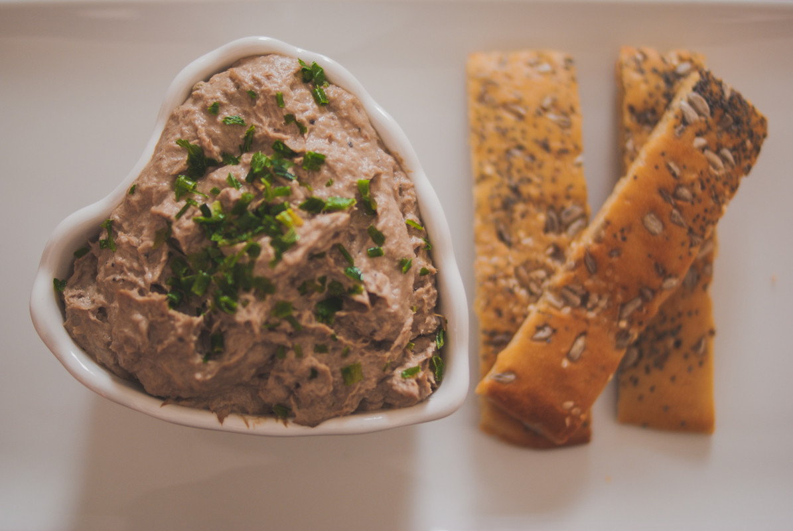

# Rillettes de sardines et ses petits pains aux graines 
(sans glutten, sans lactose et sans oeuf)  

## Ingrédients
    250g à 300g de sardines à l'huile ou au naturel selon vos préférences
    60g de sojami (fromage végétal) ail et fines herbes (du fromage frais aux fines herbes si vous tolérez le lactose)
    1 càc de moutarde (ou à soupe si vous aimez que ce soit relevé)
    Le jus d'un demi citron
    1 échalote
    du persil et de la ciboulette émincés pour décorer (facultatif)

### Petits pains aux graines
    150g de farine de riz
    100g de farine de pois chiche
    13g de Lev'Quinoa (ou votre levure boulangère sans gluten habituelle. Dans ce cas suivez les indications de proportion)
    5g de sel
    1 CàS d'huile d'olive
    200ml d'eau tiède
    2 CàS de graines de courge
    2 CàS de graines de tournesol
    1 CàS de graines de sésame
    1 CàS de graines de pavot

## Recette
Les beaux jours s'installent et avec eux les apéros en terrasse. Pourquoi ne pas accompagner ce moment convivial de rillettes de sardines à partager ? Je vous propose aujourd'hui de les déguster avec des petits pains aux graines. Cette recette est tellement simple à réaliser qu'il serait dommage de s'en priver.

Commencez par préparer vos petits pains aux graines. Mélangez tous les ingrédients dans un saladier avec une cuillère en bois ou au robot à pétrissage jusqu'à obtention d'une pâte souple mais non liquide. Couvrez votre saladier d'un linge humide et laissez pousser environ 1h30/2h à une température d'environ 20/30°C. (Votre pâte étant sans gluten, elle poussera moins qu'une pâte au blé, n'en soyez pas étonné).
Une fois la pousse terminée étalez votre pâte sur votre plaque recouverte d'un papier cuisson. Essayez de l'étaler dans une forme rectangulaire régulière. Vos petits pains seront plus jolis à la découpe. Une fois votre pâte étalée, parsemez l'ensemble des graines sur la surface de la pâte. Pour les faire pénétrer dans la pâte (afin qu'elles restent « accrochées » à la cuisson), posez un film étirable sur la surface de votre pâte et lissez doucement avec votre main ou un rouleau à pâtisserie. Enlevez ensuite délicatement le film étirable. Il se retirera sans coller à la pâte. Promis.
Laissez de nouveau pousser le temps de préchauffer votre four à 200/220°C. Enfournez pour une quinzaine de minutes. Surveillez la cuisson, votre pâte doit être bien dorée.
Une fois votre pâte bien dorée, retirez votre plaque du four. Coupez à chaud des petits pains de forme rectangulaire/carrés (à votre convenance) et retournez les sur votre plaque afin que les graines se retrouvent contre la plaque. Enfournez de nouveau pour 5 minutes.
Laissez ensuite refroidir vos petits pains sur une grille.

Égouttez les sardines et mettez-les dans le bol de votre robot mixeur. Ajoutez le reste des ingrédients et mixez jusqu'à obtention de la texture souhaitée. Vérifiez votre assaisonnement. Au besoin, ajoutez du sel et du poivre. Personnellement, je n'en ajoute pas, je trouve que le sel du fromage végétal et le piquant de la moutarde suffisent à relever le goût. Mais, n'oubliez pas, la cuisine c'est comme on aime.
Réservez au frais.

Au moment voulu, présentez vos rillettes et vos petits pains à vos convives et proposez-leur de « tartiner » à leur convenance.

> Astuce : Vous n'avez pas de graines de courges ? Vous n'aimez pas les graines de pavot ? Pas de panique. Vous pouvez ajuster la recette selon vos goûts : Graines de lin/graines de chia/sésame noir… Vous pouvez également réaliser des petits pains nature.
