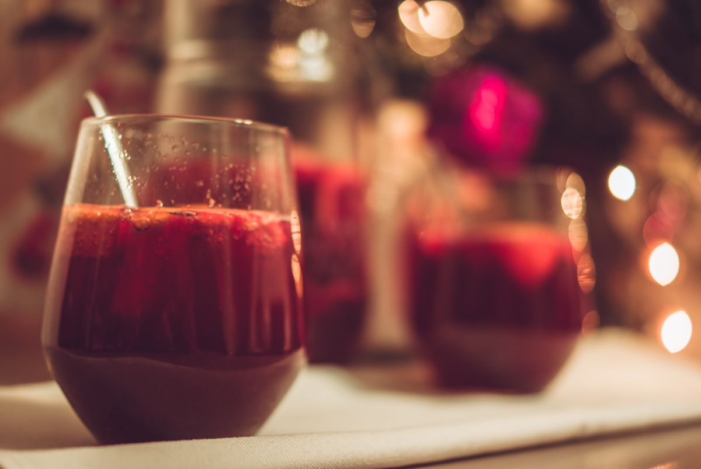

# Sangria de noël
(sans glutten, sans lactose et sans oeuf)  

## Ingrédients
Ingrédients pour environ 6 personnes

    2 bâtons de cannelle
    3 anis étoilées
    1 citron bio coupé en rondelles
    1 orange bio coupée en rondelles
    3 clémentines bio coupées en rondelles
    150g de framboises congelées
    40cl de vodka
    75cl de jus de raisin
    75cl de champagne ou de vin pétillant

## Recette
Vous en avez marre de toujours boire les mêmes cocktails à noël ? Surprenez vos invités avec une sangria revisitée… Et comme c'est noël, on l'aime avec des bulles bien sûr.

La veille, dans un grand récipient mélangez les fruits, les épices, la vodka et le jus de raisin. Réservez au frais. Au moment de servir mélangez votre préparation en prenant soin de bien piler/écraser vos fruits puis ajoutez votre champagne bien frais. Mélangez de nouveau et servez dans vos verres à cocktail.

> Astuce : Au moment de servir ajoutez des framboises congelées dans vos verres, elles serviront de glaçons. Pour les amateurs, vous pouvez également ajouter les fruits macérés dans les verres. Le saviez-vous ? Bien qu'il y ait débat, la majorité des experts estiment que les boissons alcooliques distillées, même avec des grains contenant du gluten, ne présentent pas de risque à la consommation puisque le gluten est éliminé lors de la distillation. Le produit final ne contient pas de gluten, mais ne peut pas être étiqueté comme sans gluten. En cas de doute, n'hésitez pas à taper « vodka sans gluten » dans votre moteur de recherche et vous trouverez toutes les marques de vodka considérées comme sans gluten.
