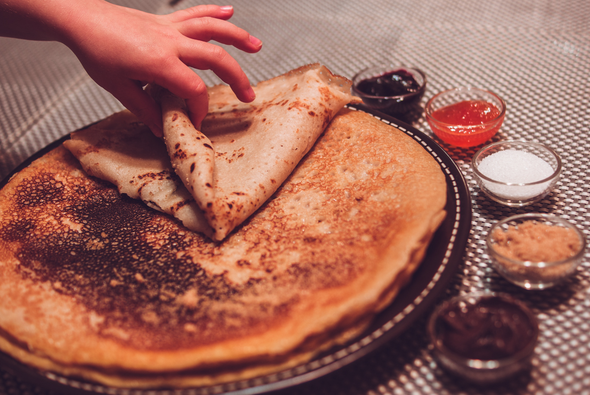

# Crêpes sans gluten et vegan 
(sans glutten, sans lactose et sans oeuf)  

## Ingrédients
Ingrédients pour 8 crêpes environ

    200g de farine de riz
    50g de Maïzena
    2 CàS de fécule de pomme de terre
    60g d’huile de pépin de raisin
     550ml de lait végétal (noisettes, amandes, soja, riz…)
    2CàS de sucre
    vanille en poudre (facutatif)

## Recette
C’est bientôt la chandeleur et vous vous dites que cette année encore vous n’en mangerez pas parce que vous êtes intolérant au gluten, au lactose et aux œufs. Que nenni, sortez votre crêpière et préparez-vous à vous régaler avec cette recette de crêpes moelleuses et savoureuses.

Dans un saladier, mélangez la farine de riz, la Maïzena, la fécule de pomme de terre, le sucre et la vanille. Mélangez bien et versez ensuite progressivement le lait. Enfin, l’huile de pépin de raisin. Laissez reposer votre pâte 30 minutes minimum.
Faites chauffer votre crêpière. Graissez-la avec un peu de beurre végétal. Versez la pâte sur votre poêle chaude à l’aide d’une louche. Laissez dorer et retournez votre crêpe avec une spatule. Laissez dorer de l’autre côté. Renouvelez l’opération jusqu’à épuisement de la pâte.
Dégustez avec l’accompagnement de votre choix : pâte à tartiner, confiture, sucre en poudre, sirop d’érable…

> Astuce : Les crêpes sans gluten et vegan sont plus fragiles qu’une recette traditionnelle, ne les faites donc pas trop fines. Pour la même raison, utilisez une poêle de petite circonférence. Pour varier les plaisirs, [c'est par ici](../desserts/Pate-a-tartiner-choco-noisettes.md).
