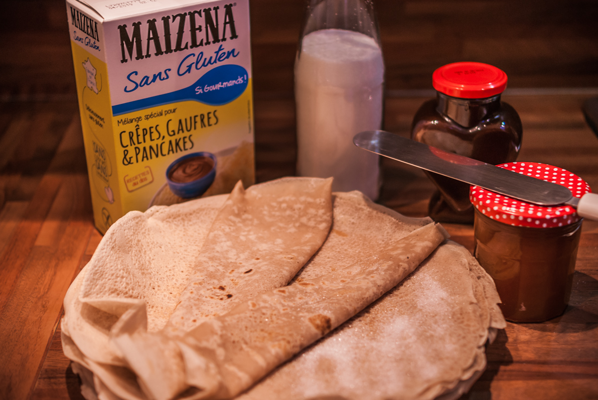

# Crêpes
(sans glutten, sans lactose et sans oeuf)  

## Ingrédients
Ingrédients pour 4 personnes

    300g de préparation Maïzena, sans gluten, pour crêpes
    2 CàS de fécule de pomme de terre
    60 cl de lait végétal (noisettes, amandes, soja, riz…)
    30g de beurre végétal fondu
    60g de sucre
    vanille en poudre

## Recette
Que ce soit pour la chandeleur, pour le goûter, pour le dessert ou encore pour le petit déjeuner, tout le monde adore les crêpes. Quand on est intolérant au gluten, au lactose et aux œufs, cela devient tout de suite compliqué d'assouvir ce petit plaisir… Pas de panique, sortez, vos confitures, sirop d'érable et autres pâtes à tartiner, j'ai la solution.

Dans un saladier, mélangez la farine maïzena sans gluten, la fécule, le sucre et la vanille, mélangez bien et versez progressivement le lait et le beurre fondu. Laissez reposer votre pâte 30 minutes minimum.
Faites chauffer votre crêpière. Graissez-la avec un peu de beurre végétal. Versez la pâte sur votre poêle chaude à l'aide d'une louche. Laissez dorer et retournez votre crêpe avec une spatule. Laissez dorer de l'autre côté. Renouvelez l'opération jusqu'à épuisement de la pâte.
Dégustez avec l'accompagnement de votre choix : pâte à tartiner, confiture, sucre en poudre, sirop d'érable…

> Astuce : Attention, la préparation pour crêpes Maïzena sans gluten peut contenir des traces d'œufs. Pour une pâte à tartiner choco-noisettes, [c'est par ici](../desserts/Pate-a-tartiner-choco-noisettes.md)
