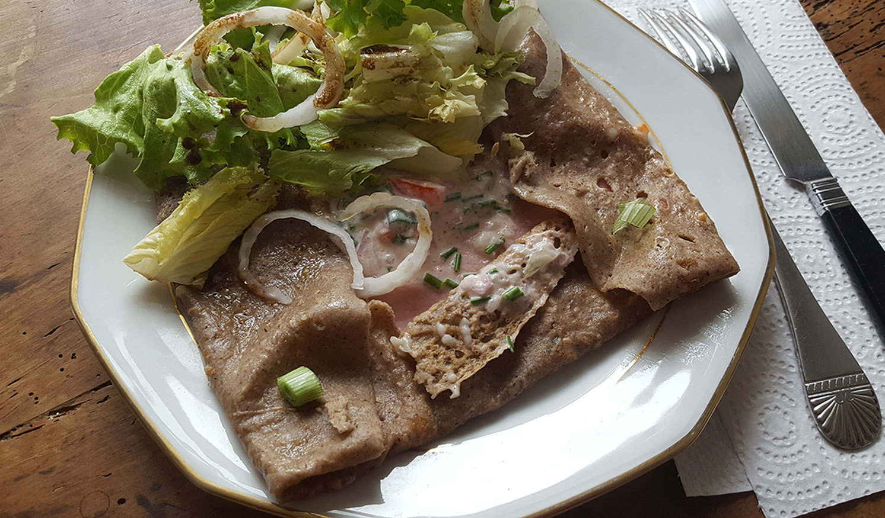

# Galette bretonne, sauce crème végé tomates et fines herbes
(sans glutten, sans lactose et sans oeuf)  

## Ingrédients
Ingrédients pour 4 personnes

    4 galettes bretonnes (galettes sarrasin ou galettes de blé noir)

### Pour la garniture

    15 cl de crème végétale épaisse
    1 échalote
    1 petit oignon nouveau
    1 bouquet de ciboulette
    1 tomate charnue
    sel, poivre
    4 tranches de jambon sans gluten
    Beurre végétal

## Recette
Les galettes bretonnes, autrement appelées galettes de sarrasin ou galettes de blé noir, comme nous l'avons déjà évoqué sont parfaites quand on est intolérant au gluten. Ayant grandi en Bretagne, la galette est pour moi un incontournable qui s'accommode de bien des manières. Aujourd'hui c'est une recette « dents blanches et haleine fraîche que je vous propose »… Alors, sortez vos pastilles à la menthe parce qu'on s'est régalés.

Commencez par préparer vos ingrédients. Lavez et émincez votre ciboulette. Faites de même avec l'échalote et l'oignon nouveau. Lavez votre tomate et coupez-la en petits morceaux. Mélangez le tout avec votre crème végétale. Salez et poivrez à votre convenance.

Pour garnir votre galette. Mettez du beurre végétal dans votre crêpière bien chaude. Déposez-y une galette, laissez dorer quelques secondes puis retournez là. Tartinez, 1 CàS de votre crème végétale à la tomate et aux fines herbes sur la galette. Ajoutez ensuite au centre de la galette une tranche de jambon puis de nouveau 1 CàS de crème végétale à la tomate et aux fines herbes. Rabattez ensuite les bords de la galette vers le centre en laissant apparaitre votre garniture. C'est prêt. Vous pouvez servir avec une salade verte et surtout, avec une bolée de cidre, c'est encore meilleur.
Yec'hed mat ! Kalon digor !

> Astuce : Une galette bretonne salée, c'est toujours sympa accompagné d'une petite salade verte ;) Et, pour varier les plaisirs, c'est par ici :
> - [Wraps de galettes de sarrasin au saumon fumé et guacamole](../apero/Wraps-de-galettes-de-sarrasin-au-saumon-fume-et-guacamole.md)
> - [Galette bretonne aux légumes du soleil](./Galette-bretonne-aux-legumes-du-soleil.md) 
