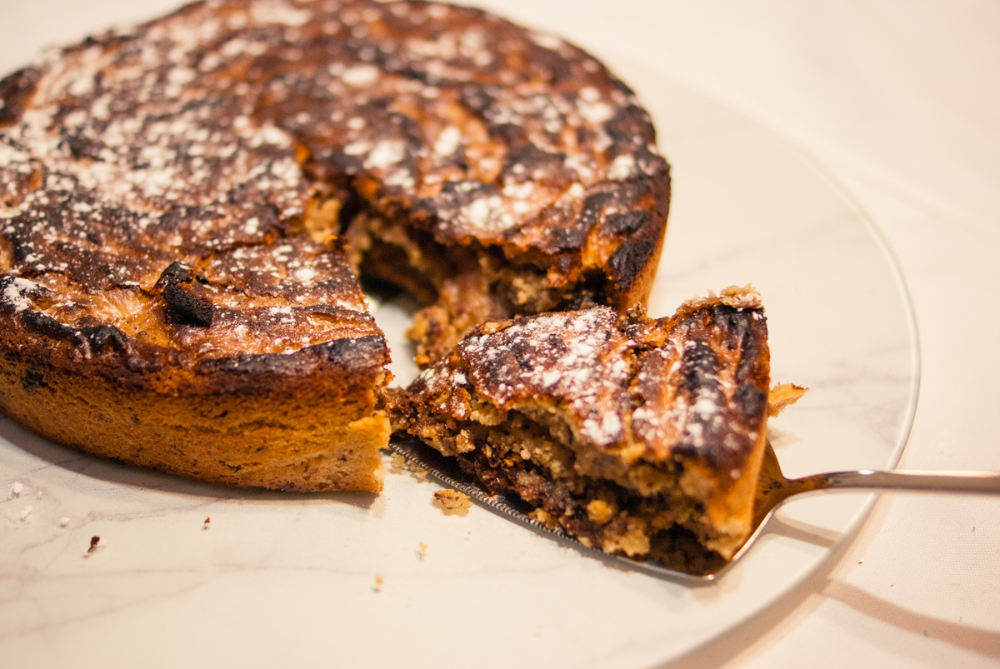

# Blondie de Noël à la crème de marrons
(sans glutten, sans lactose et sans oeuf)  

## Ingrédients
Pour un moule de 22 cm de diamètre

    330g de sucre roux
    115g de beurre végétal fondu
    2 CS de fécule de maïs
    20cl de lait végétal
    250g de crème de marrons
    250g de farine de riz
    1 ½ càc de levure sans gluten
    150g de chocolat noir concassé

## Recette
En pâtisserie, le blondie est l’inverse du brownie, pas de chocolat noir fondu dans la pâte. Pour ce blondie de noël, le chocolat fondu est remplacé par de la crème de marron mais on garde quand même la gourmandise du chocolat avec des brisures de chocolat noir. Cette petite bombe est parfaite pour le goûter avec un bon café.

Préchauffez votre four à 180°.
Mélangez le beurre fondu et le sucre. Ajoutez la fécule délayée dans le lait végétal puis la crème de marrons. Ajoutez enfin la farine de riz et la levure. Mélangez bien et terminez par le chocolat noir concassé. Versez la préparation dans un moule généreusement beurré et faites cuire pendant 25 à 30 minutes. Laissez refroidir avant de démouler. Servir tiède ou froid.

> Astuce : Vous pouvez remplacer le sucre roux par du sucre muscovado pour un goût plus intense.
