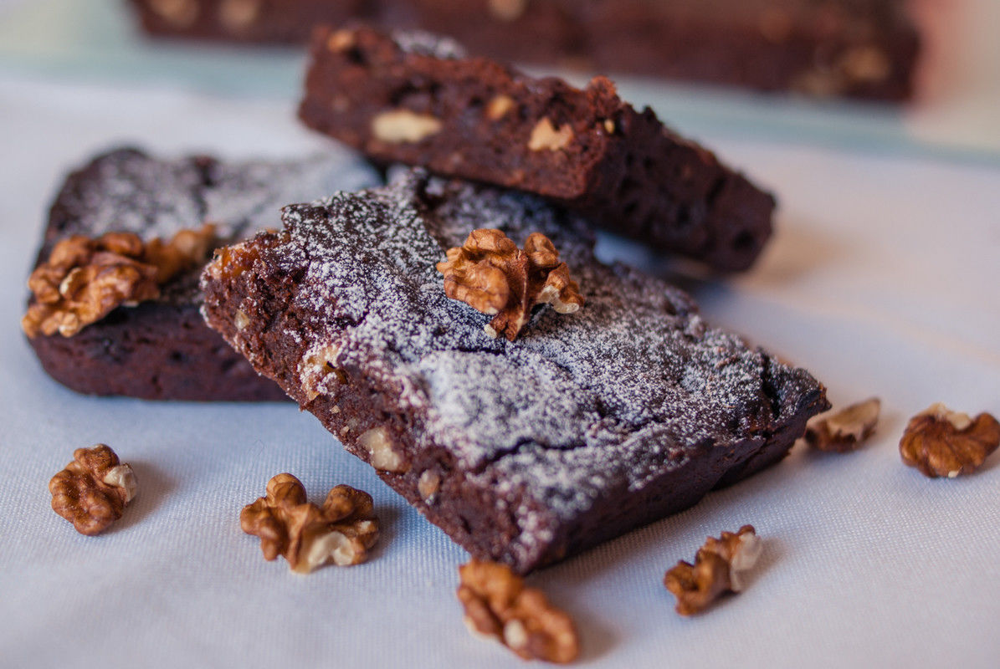

# Brownie aux noix caramélisées
(sans glutten, sans lactose et sans oeuf)  

## Ingrédients
### Pour un moule de 23x23 cm
    300 g de yaourt au lait de soja
    90 g de sucre de canne
    1 càc bombée de cacao en poudre non sucré
    2 CàS d'huile de pépin de raisin
    115 g de chocolat noir
    60 g de beurre sans lactose ou de soja
    75 g de farine de riz
    40 g de farine de châtaigne
    2 càc de fécule de pomme de terre
    2 càc de levure chimique sans gluten
    1 belle pincée de fleur de sel (sauf si votre levure contient du sodium)
    90 g de noix caramélisées (noix de pécan, noix de macadamia, noisettes…. N'oubliez pas, la cuisine c'est comme on aime)

### Pour les noix caramélisées
    15 g d'eau
    60 g de sucre semoule
    90 g de noix
    1 càc de beurre végétal
    1 pincée de fleur de sel

## Recette
Un brownie sans œuf, sans gluten et sans lactose, quand les grands chefs s'y mettent, cela donne des recettes inoubliables. Je me suis aujourd'hui inspirée du gâteau « Brownie » de Philippe Conticini. Une recette à la fois fondante, croquante et forte en chocolat.

Réalisez les noix caramélisées :

Dans une casserole, portez à ébullition l'eau avec le sucre, ajoutez les noix. Enrobez-les soigneusement avec ce sirop de sucre, puis faites cuire le tout pendant environ 20 minutes sans jamais cesser de remuer avec une cuillère en bois pour éviter aux fruits secs de brûler. Le sucre, qui blanchit quelques minutes après l'adjonction des fruits secs, va finir par caraméliser de toutes parts. À la fin de la cuisson, les fruits secs seront bien brillants et ils auront pris une jolie couleur brune. Ajoutez en fin de cuisson le beurre et la fleur de sel.
Versez les fruits secs ainsi caramélisés sur une plaque légèrement huilée ou sur du papier cuisson, puis étalez-les pour que cela refroidisse plus rapidement. Quand ils sont bien froids, concassez-les.

Réalisez le brownie :

Allumez votre four à 180 °C.
Dans un saladier, détendez avec un fouet le yaourt au lait de soja avec le sucre de canne. Ajoutez le cacao, puis l'huile. Incorporez ensuite le chocolat fondus au bain-marie avec le beurre. Mélangez bien, mais pas trop longtemps. Ajoutez les farines, la fécule, la levure chimique et éventuellement la fleur de sel. Ajoutez les noix concassées au mélange.
Versez la pâte dans un moule graissé. Enfournez pour 20/25 minutes. Surveillez la cuisson.

> Astuce : Pour plus de gourmandise, servez votre brownie avec un coulis de caramel, une glace, un sorbet ou encore une chantilly végétale.
> Pour la recette originale de Philippe Conticini, [c'est par ici](https://m.facebook.com/story.php?story_fbid=681936731965965&substory_index=0&id=101025623390415)
