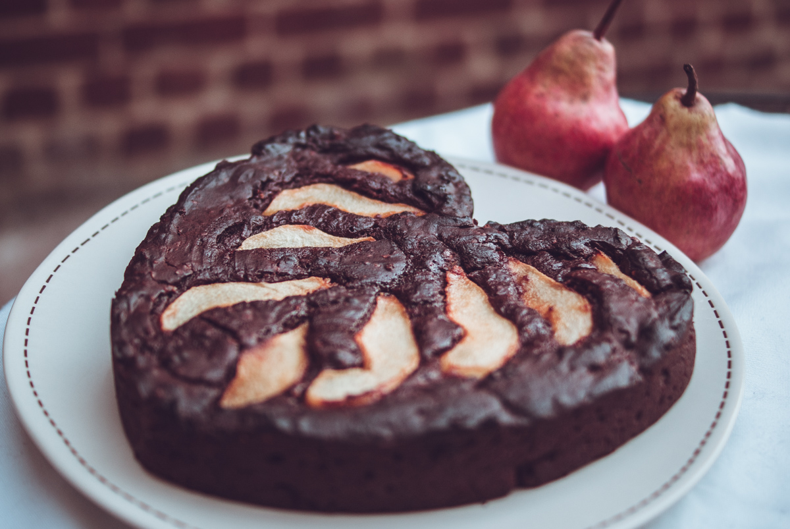

# Brownie aux poires
(sans glutten, sans lactose et sans oeuf)  

## Ingrédients
Pour 6 personnes environ

    300 g de yaourt vanille au lait de soja
    90 g de sucre de canne
    1 càc bombée de cacao en poudre non sucré
    2 CàS d’huile de pépin de raisin
    115 g de chocolat noir
    60 g de beurre végétal
    75 g de farine de riz
    40 g de farine de châtaigne
    2 càc de fécule de pomme de terre
    2 càc de levure chimique sans gluten
    1 belle pincée de fleur de sel (sauf si votre levure contient du sodium)
    75g de pépites de chocolat
    75g de pralin haché
    1 ou 2 poires
    Caramel liquide

## Recette
Il y a quelques temps déjà, je vous avais proposé une recette de brownie aux noix, inspirée de Philippe Conticini. Aujourd’hui c’est une autre variante de cette recette que je vous propose avec un fruit de saison, la poire.

Allumez votre four à 180 °C.
Dans un saladier, détendez avec un fouet le yaourt vanille au lait de soja avec le sucre de canne. Ajoutez le cacao, puis l’huile. Incorporez ensuite le chocolat fondu au bain-marie avec le beurre. Mélangez bien, mais pas trop longtemps. Ajoutez les farines, la fécule, la levure chimique et éventuellement la fleur de sel. Ajoutez le pralin haché et les pépites de chocolat.
Versez la pâte dans un moule graissé. Épluchez vos poires et coupez-les en quartiers que vous déposez sur la pâte. Enfoncez-les légèrement avec le doigt. Versez sur les poires un peu de caramel liquide. Enfournez pour 20/25 minutes. Surveillez la cuisson. A servir tiède ou froid.

> Astuce : Pour plus de gourmandise vous pouvez également réaliser cette recette en part individuelles. Versez alors votre pâte dans des ramequins individuels et déposez dans chaque ramequin une demie poire coupée en lamelles. Vous pouvez acheter votre caramel liquide dans le commerce ou le faire maison. C’est simple et il se conserve longtemps dans un récipient hermétique et au frais : Dans une casserole faites chauffer 500g de sucre avec 1CàS de vinaigre blanc et 10cl d’eau. Une fois le caramel brun, versez 20cl d’eau. Attention de ne pas vous brûler, le caramel « saute ». Remettre sur le feu en remuant. A la première ébullition c’est prêt. Si vous souhaitez découvrir ou redécouvrir le brownie aux noix caramélisées [c'est par ici](./Brownie-aux-noix-caramelisees.md).
