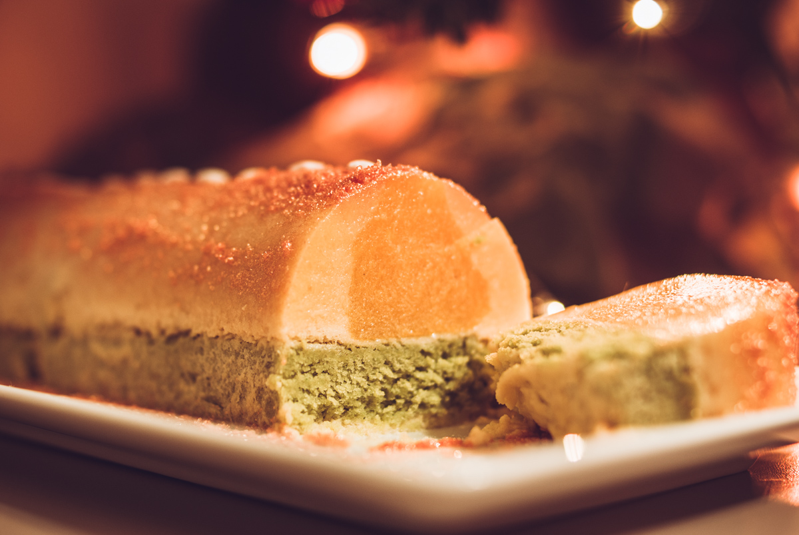

# Bûche mousse coco et passion, insert mangue et son biscuit pistache
(sans glutten, sans lactose et sans oeuf)  

## Ingrédients
Ingrédients

### Insert mangue

    La chair d’une grosse mangue soit environ 450g
    5g de gélatine
    4 CàS de sucre
    Les grains d’une demi gousse de vanille (facultatif)

### Mousse coco passion

    150g de crème de coco
    100ml de jus de passion (4 fruits)
    6 Càs de sucre
    6g de gélatine
    50g de jus de pois chiche

### Biscuit pistache

    2 CàS de purée de pistache
    2 CàS d’huile de pépin de raisin
    50g de sucre en poudre
    100g de yaourt de soja nature
    1 càc rase de levure sans gluten
    100g de farine de riz complet

## Recette
Si vous n’avez pas encore décidé qu’elle sera votre bûche de noël cette année, ne cherchez plus. Le trio mangue, passion et coco se marie très bien avec la pistache. Une bûche fraîche et légère qui sera parfaite en fin de repas.

Pour réaliser cette bûche il faudra vous y prendre au moins la veille.
Commencez par réaliser l’insert à la mangue. Réhydratez la gélatine dans un peu d’eau froide. Pendant ce temps, pelez la mangue, récupérez la chair et mixez-la avec la vanille. Faites chauffer cette préparation avec le sucre et mélangez bien. A ébullition incorporez la gélatine que vous aurez pris le soin d’égoutter. Mélangez bien au fouet et versez dans votre moule à insert. Laissez prendre au frais quelques heures.
Réalisez ensuite le biscuit à la pistache. Allumez votre four à 180°.
Mélangez la purée de pistache et l’huile de pépin de raisin. Incorporez ensuite le sucre et le yaourt puis la levure et la farine. Mélangez bien. Etalez votre pâte sur une plaque recouverte de papier sulfurisé. Etalez la pâte aux dimensions de votre moule à bûche. Enfournez pour 10 à 12 minutes. La surface doit être dorée. Laissez refroidir.
Quand votre insert à la mangue est pris. Préparez votre mousse passion coco.
Commencez par extraire le jus des fruits de la passion. Pour cela, coupez-les en 2. Extrayez tout le contenu des fruits avec une cuillère et versez les dans une passoire que vous aurez pris soin de poser sur un saladier. Avec la maryse, donnez un mouvement de va et viens pour pressez doucement les pépins contre le fond de la passoire. Ce geste va en extraire le jus qui tombe au fond du saladier. Arrêtez-vous quand il ne reste plus que des grains noirs dans la passoire, que vous pouvez jeter. Réservez le jus. Réhydratez votre gélatine dans l’eau froide.
Montez ensuite la crème de coco. Pour cela, vous devez extraire la crème de coco qui se trouve sur le dessus de la boite de conserve. Pour une boite de 400ml vous devriez pouvoir en obtenir 150g. Montez là au fouet. La matière grasse végétale contenue dans la crème de coco lui permet de monter un peu comme de la chantilly.
Ensuite, faites chauffer le jus de passion avec le sucre. A ébullition ajoutez la gélatine que vous aurez pris soin d’égoutter. Mélangez bien au fouet et réservez.
Montez enfin le jus de pois chiche comme des blancs en neige.
Finissez en mélangeant le jus de passion avec la crème coco montée. Une fois les 2 appareils bien mélangez, ajoutez les blancs en neige. Mélangez délicatement.

Passez au montage de votre bûche.
Commencez par découper votre biscuit pistache aux dimensions de votre moule à bûche. Dans votre moule à bûche versez une partie de la mousse coco. Déposez ensuite délicatement votre insert à la mangue et finissez de recouvrir de mousse coco passion. Déposez enfin votre biscuit à la pistache. Laissez prendre au frais.
Une fois votre mousse prise. Déposez votre moule au congélateur pendant quelques heures. Cela facilitera le démoulage.

Préparez votre bûche environ 1 heure avant de la déguster.
Sortez-la du congélateur et démoulez-là.  Laissez-là décongeler avant de la décorer à votre convenance. J’ai pour ma part opté pour la simplicité avec un sucre doré.
Si nécessaire replacez-là au frais avant de déguster et joyeux noël bien sûr ;)
