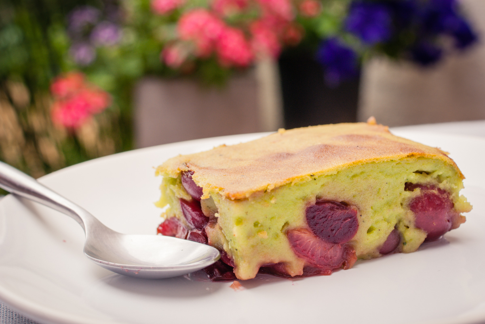

# Clafoutis aux cerises et purée de pistache
(sans glutten, sans lactose et sans oeuf)  

## Ingrédients
Pour un moule de 18cm de diamètre.
(4 à 6 gourmands)

    75g de purée de pistaches
    400g de yaourt végétal nature (soja- amande-coco…)
    40g de sirop d'agave
    20g de fécule de maïs
    30g de farine de maïs
    400g de cerises dénoyautées
    Sucre facultatif pour les fruits

## Recette
Il vous reste encore des cerises ? Que diriez-vous d'un bon clafoutis ? Ce dessert fait vraiment parti de mes souvenirs gourmands avec les cerises du jardin. Régulièrement je cherche de nouvelles recettes pour satisfaire ma gourmandise et cette fois-ci c'est une recette parfumée à la purée de pistache que je vous propose. La saveur pistache se marie bien avec les fruits rouges. Qu'en pensez-vous ?

Préchauffez votre four à 180°.
Dans un saladier délayez la purée de pistaches avec le yaourt nature puis le sirop d'agave. Ajoutez la fécule et la farine de maïs et mélangez le tout. Vous devez obtenir une pâte homogène un peu épaisse mais pas trop liquide.
Dans votre moule préalablement graissé, répartissez les cerises dénoyautées. Si vous aimez vos fruits bien sucrés, saupoudrez-les d'un peu de sucre. Recouvrez-les avec l'appareil à clafoutis. Enfournez pour environ 30 minutes. Laissez tiédir ou refroidir votre clafoutis avant de le déguster.

> Astuce : Vous voulez varier les plaisirs avec d'autres recettes de clafoutis? C'est par ici :
> - [Clafoutis aux framboises](./Clafoutis-aux-framboises.md)
> - [Clafoutis aux cerises](./Clafoutis-aux-cerises.md)
