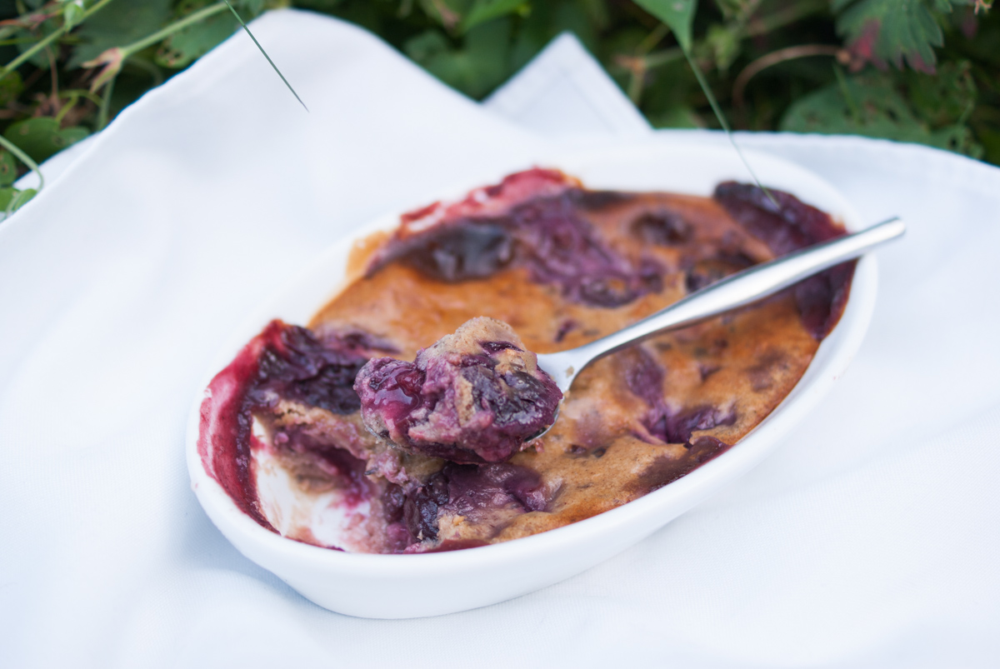

# Clafoutis aux cerises
(sans glutten, sans lactose et sans oeuf)  

## Ingrédients
Pour un moule de 18cm de diamètre.
(4 à 6 gourmands)

    90g de purée de noisettes
    400g d'amande cuisine
    40g de sirop d'érable
    20g de fécule de pomme de terre
    50g de poudre de noisettes
    30g de farine de riz
    400g de cerises dénoyautées

## Recette
La saison des cerises est terminée mais j'en avais quelques-unes dans le congélateur et une furieuse envie d'un bon clafoutis. L'année dernière je vous avais déjà proposé une version aux framboises, cette année j'ai un peu changé l'appareil pour vous proposer une version aux saveurs de noisettes.

Préchauffez votre four à 180°.
Dans un saladier délayez la purée de noisettes avec l'amande cuisine puis le sirop d'érable. Ajoutez la fécule, la farine de riz et la poudre de noisettes et mélangez le tout. Vous devez obtenir une pâte homogène un peu épaisse mais pas trop liquide.
Dans votre moule préalablement graissé, répartissez les cerises dénoyautées. Recouvrez vos fruits avec l'appareil à clafoutis. Enfournez pour environ 25 minutes. Laissez refroidir votre clafoutis avant de le déguster.

> Astuce : Ajoutez 1 CàS de rhum ou de kirsch pour parfumer votre pâte. Vous pouvez bien sûr opter pour d'autres fruits de saison.
