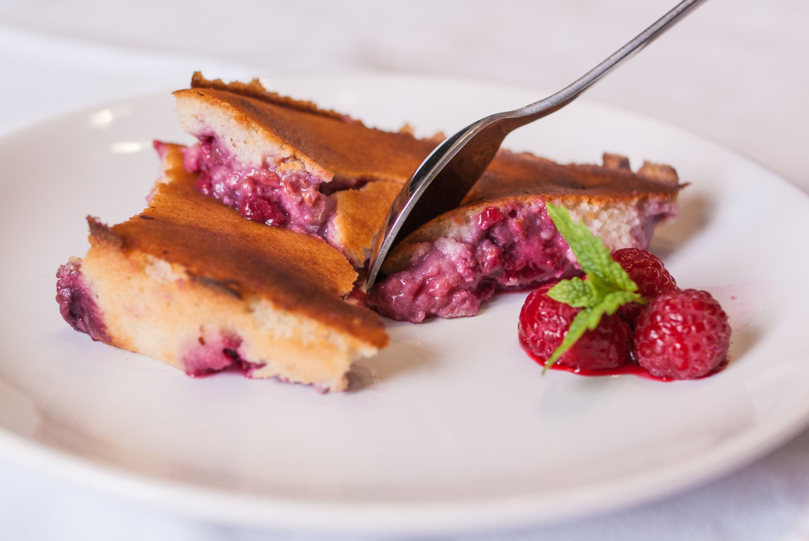

# Clafoutis aux framboises
(sans glutten, sans lactose et sans oeuf)  

## Ingrédients
Pour un moule de 18cm de diamètre.
(4 à 6 gourmands)

    30g de purée d'amande blanche
    200g de yaourt au soja nature
    40g de sucre (+ 1 CàS)
    20g de fécule de pomme de terre
    50g de poudre d'amande
    30g de farine de riz
    30g de beurre végétal fondu
    100g de lait d'amande
    300g de framboises

## Recette
C'est la saison des fruits rouges :) A la maison, mes gourmands aiment les framboises, j'ai donc voulu tenter un clafoutis. La recette originale du clafoutis c'est surtout de la crème et des œufs, un véritable challenge donc pour le réaliser sans. Il existe plusieurs textures de clafoutis, chez nous on l'aime moelleux et crémeux, avec les fruits qui « compotent » dans l'appareil. Après un essai un peu trop compact et quelques réajustements, voici donc ma version du clafoutis sans gluten, sans lactose et sans œufs.

Préchauffer votre four à 180°.
Dans un saladier délayez la purée d'amande avec le yaourt au soja. Ajoutez le sucre, la fécule, la poudre d'amande et mélangez le tout. Ajoutez la farine de riz et mélangez de nouveau afin d'obtenir un appareil homogène. Ajoutez ensuite le beurre fondu. Mélangez jusqu'à absorption complète. Ajoutez enfin le lait d'amande. Mélangez. Ajoutez si nécessaire du lait d'amande (selon la capacité d'absorption de votre farine), vous devez obtenir une pâte homogène un peu épaisse mais pas trop liquide.
Dans votre moule préalablement graissé, répartissez les framboises. Saupoudrez-les d'une cuillère à soupe de sucre. Cet ajout est facultatif. Tout dépend de votre goût pour l'acidité ou le sucre.
Recouvrez vos fruits avec l'appareil à clafoutis. Enfournez pour environ 30 minutes. Laissez refroidir votre clafoutis avant de le déguster.

> Astuce : Ajoutez de la vanille ou du rhum pour parfumer votre pâte. Vous pouvez bien sûr opter pour d'autres fruits de saison.
