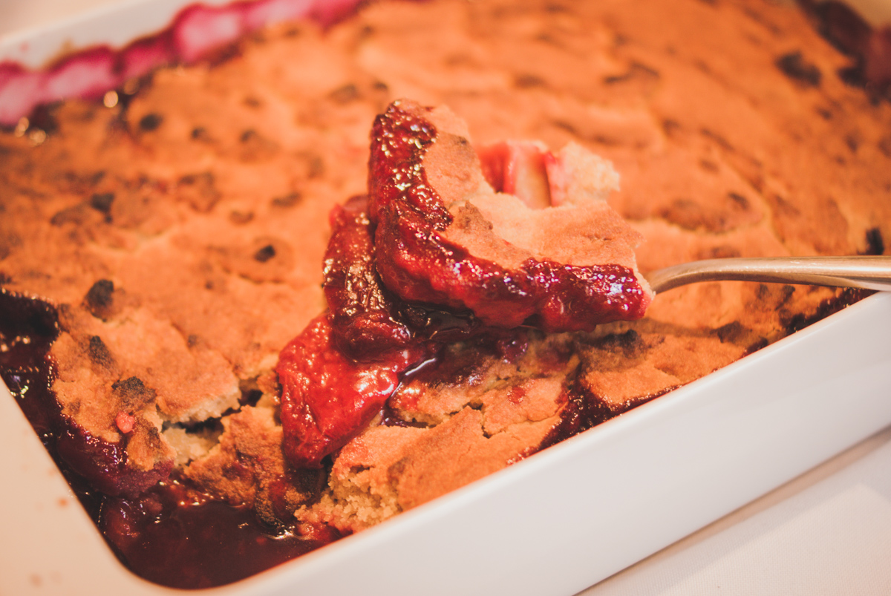

# Cobbler aux prunes
(sans glutten, sans lactose et sans oeuf)  

## Ingrédients
Ingrédients pour 6 à 8 personnes

    800g/1kg de prunes
    200g de beurre végétal fondu
    120g de sucre muscovado (ou de sucre de canne)
    300g de farine de riz complet
    100g de crème végétale
    1 càc de levure sans gluten
    vanille en poudre

## Recette
C’est encore la saison des prunes, je vous propose donc aujourd’hui de les déguster avec la simplicité d’une recette de cobbler. Le cobbler est une recette très présente aux Etats-Unis. Un peu comme notre crumble il est composé de fruits recouverts de biscuit. Une recette moelleuse qui vous plaira certainement.

Faites préchauffer votre four à 180°.
Dans une poêle faites revenir les prunes lavées et dénoyautées et coupées en 2 avec un peu de beurre. Si vos prunes sont un peu acides, n’hésitez pas à les sucrer légèrement. Une fois les prunes légèrement compotées, déposez les dans un plat haut allant au four et légèrement beurré.
Mélangez ensuite tous les éléments de la pâte : le beurre végétal, le sucre, la farine, la crème végétale, la levure et la vanille.
Déposez la pâte sur les prunes, cuillérée par cuillerée. Enfournez pour 35/40 minutes.
Dégustez tiède ou froid.

> Astuce : Vous pouvez réaliser cette recette avec de nombreux fruits : pêches, poires, fruits rouges, figues…
