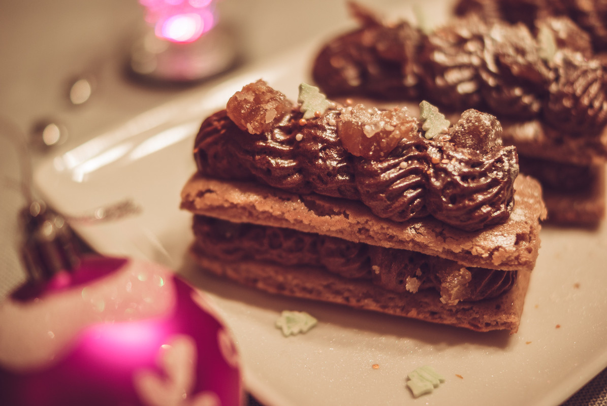

# Comme une bûche chocolat et marrons 
(sans glutten, sans lactose et sans oeuf)  

## Ingrédients
Ingrédients pour 12 petites buchettes

### Pour la génoise
    50g de farine de riz
    50g de farine de châtaignes
    50g de fécule
    150g de sucre
    1 càc de levure
    1 pointe de vanille en poudre
    2 yaourts soja nature
    100g de jus de pois chiche
    1 càc de fécule de pomme terre

### Pour la mousse chocolats et crème de marrons
    170g de jus de pois chiche
    200g de chocolat
    250g de crème de marrons
    2CàS de lait de noisette (ou autre lait végétal)
    6 marrons glacés pour la garniture

## Recette
Que serait noël sans sa traditionnelle bûche au chocolat ? Pour moi, elle est indissociable de noël et fait partie de mes souvenirs d'enfance. C'est une bûche décomposée que je vous propose aujourd'hui. Une génoise à la farine de châtaignes, accompagnée d'une mousse au chocolat et crème de marrons. Si je ne vous propose pas une bûche roulée c'est tout simplement parce qu'une génoise sans gluten et sans œufs ne se roule pas facilement… elle se casse. Mais, je n'ai pas dit mon dernier mot et je continue les essais. Je suis une amoureuse des bûches de noël, avec une génoise roulée, et je compte bien y arriver… L'année prochaine peut-être ?

Commencez par préparer votre mousse. Dans un saladier, détendez la crème de marrons à l'aide du lait végétal. Faites fondre le chocolat comme à votre habitude et incorporez le progressivement à la crème de marrons. Montez le jus de pois chiche à l'aide du batteur. (Grâce aux protéines contenues dans le jus, celui-ci va monter comme des blancs d'œufs. Cette opération prend toutefois un peu plus de temps). Une fois vos blancs prêts, incorporez en 1 à 2 cuillères à votre mélange chocolat et marrons. Renouvelez l'opération. Incorporez ensuite le reste en mélangeant délicatement. (Votre préparation vous paraîtra peut-être un peu liquide mais rassurez-vous, elle se figera très bien au frais). Coulez votre préparation dans une poche à douille et laissez prendre au frais.

Réalisez ensuite la génoise. Préchauffez votre four à 180°. Dans un saladier, mélangez le sucre et les yaourts au soja. Ajoutez ensuite les farines, la fécule, la levure et la vanille. Mélangez bien. Montez le jus de pois chiche en neige avec une càc de fécule. Une fois les blancs montés, incorporez les à la préparation précédente et versez dans votre plaque à génoise préalablement graissée. (Si vous n'en avez pas, la lèche frite de votre four recouverte de papier cuisson, fera l'affaire).
Enfournez pour 10 minutes. Une fois votre génoise cuite, laissez la refroidir à même la plaque.

Une fois votre génoise froide, procédez au dressage. Découpez votre plaque en 24 parts de taille égale. (J'ai pour cela utilisé un emporte-pièce). Concassez vos marrons glacés en morceaux. Dans vos assiettes à dessert ou dans un plat de dressage, alternez la génoise, la mousse et des morceaux de marrons glacés. Décorez à votre convenance à l'aide de sucres dorés/argentés, de paillettes alimentaires, etc.
Vous pouvez dresser vos parts à l'avance et conserver au frais, la mousse se tient très bien.

> Astuce : N'hésitez pas à puncher votre génoise à l'aide d'un sirop d'alcool flambé. Attention cependant, elle sera beaucoup plus fragile. Avec ses proportions, j'ai réalisé 12 petites parts. Si vous êtes gourmands, ces proportions conviennent également pour 6 personnes.
