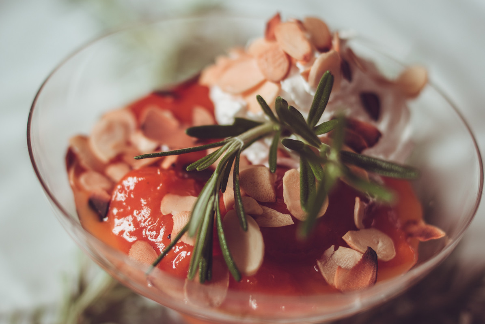

# Compotée d'abricots au miel et au romarin
(sans glutten, sans lactose et sans oeuf)  

## Ingrédients
Pour 4 personnes

    Une douzaine d'abricots (des gros de préférence)
    1 grosse cuillère à soupe de miel toutes fleurs
    1 grosse cuillère à soupe de beurre végétal
    Une belle branche de romarin (environ 20 cm)
    40g d'amandes effilées

## Recette
C'est encore la saison des abricots, vous vous êtes surement fait plaisir tout au long de l'été en les dégustant nature, en tartes ou en clafoutis. Aujourd'hui, je vous propose de les marier au goût subtil du romarin et du miel. Un pur délice aux parfums de vacances au soleil.

Commencez par lavez et couper vos abricots en quartiers. Réservez.
Dans une poêle ou une sauteuse faites fondre le beurre avec le miel et la branche de romarin. A ébullition ajoutez les quartiers d'abricots. Laissez compoter pendant environ 10 minutes en remuant régulièrement. Les quartiers d'abricots doivent être moelleux mais rester entier.
Pendant ce temps, faites torréfier vos amandes. Placez-les à sec dans une poêle et faites chauffer en remuant jusqu'à ce qu'ils soient dorés. Attention cela va très vite.

Une fois les abricots cuits. Précédez au dressage. Enlevez les brins de romarin de la poêle. Répartissez dans les coupes à dessert. Placez au frais quelques heures. Au moment de servir, saupoudrez d'amandes effilées torréfiées.

> Astuce : Pour plus de gourmandise, vous pouvez accompagner cette comptée d'une chantilly ou d'une glace végétale et de petits sablés (sans gluten, sans œufs et sans lactose bien sûr ;) )
