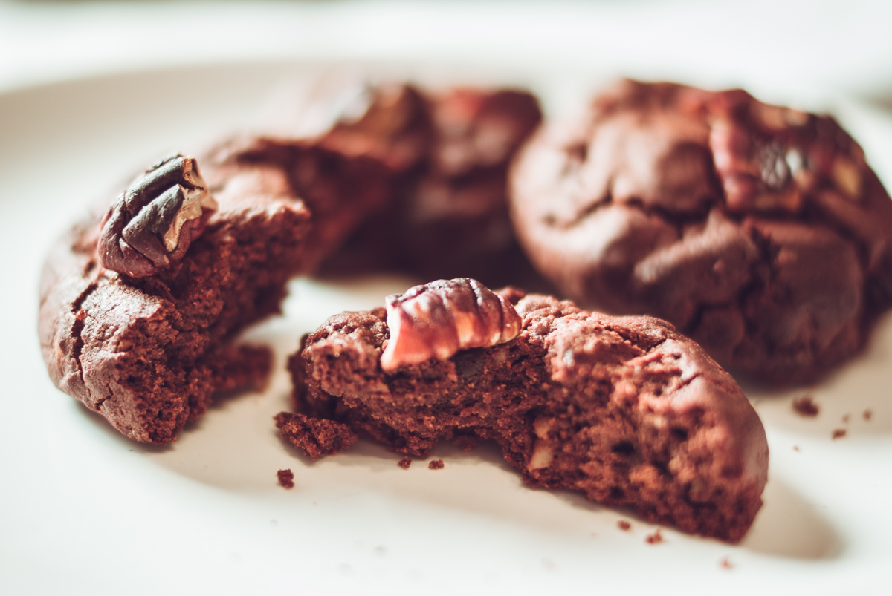

# Cookies-Brownie à la noix de pécan
(sans glutten, sans lactose et sans oeuf)  

## Ingrédients
Ingrédients pour 25-30 cookies

    320g de chocolat noir
    80g de beurre végétal
    160ml de lait de noisettes
    280g de farine de riz
    110g de muscovado (ou de sucre de canne)
    40g de fécule de pomme de terre
    40g de noix de pécan moulues
    1 pincée de sel
    1càc de levure
    100g de pépites de chocolat
    40g de noix de pécan concassées

## Recette
Vous aimez les cookies et le brownie et vous ne pouvez pas choisir ? J'ai la solution ! De délicieux cookies, croustillants et moelleux comme des cookies au bon goût de brownie. Et en plus ils sont sans gluten et vegan ;)

Dans une casserole, à feux doux faites fondre le chocolat avec le lait de noisettes et le beurre végétal.
Pendant ce temps, dans un saladier, mélangez la farine, le muscovado, la fécule, la poudre de pécan, le sel et la levure.
Une fois le chocolat fondu, ajoutez-le à vos ingrédients secs. Mélangez bien. Votre pâte sera « tiède » à cause du chocolat fondu que vous venez d'ajouter. Une fois votre pâte refroidie, ajoutez les pépites de chocolat. Laissez votre pâte reposer au froid pendant une trentaine de minutes.
Faites chauffer votre four à 180°.
Confectionnez des boules de pâte et déposez-les sur une plaque allant au four (en silicone ou sur un papier cuisson dans la lèche frite de votre four). Sur chaque boule de pâte enfoncez quelques morceaux de noix de pécan concassées. Faites cuire 15 minutes environ. Vérifiez la cuisson. Faites refroidir vos cookies sur une grille. Pour les enlever de votre plaque de cuisson, utilisez une spatule car ils sont fragiles quand ils sont chauds.
A déguster en dessert, au café, au goûter… Se conservent quelques jours dans une boîte hermétique.

> Astuce : Vous pouvez bien sûr remplacer le lait de noisettes par n'importe quel autre lait végétal. Vous n'aimez pas/ n'avez pas de noix de pécan? Vous pouvez les remplacer par des noisettes, des noix de Grenoble, des noix de macadamia...
