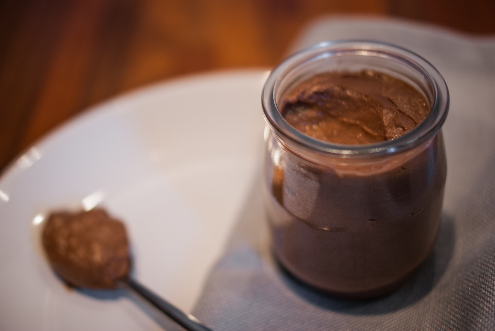

# Crème dessert au chocolat 
(sans glutten, sans lactose et sans oeuf)  

(sans glutten, sans lactose et sans oeuf)  

## Ingrédients
Pour 8 à 10 personnes

    1 litre de lait d'amande
    200g de chocolat noir
    50g de fécule de pomme de terre (ou de maïzena)
    50g de sucre
    100ml d'amande cuisine

## Recette
Cette recette et ses variantes se trouvent un peu partout sur le net sous l'appellation « crème façon Danette au chocolat ». Je trouve cependant que le résultat est beaucoup plus consistant qu'une Danette. Au goût intense de chocolat, cette crème est parfaite en dessert ou à 4 heures, accompagnée de biscuits.

Voici ma version :

Faire fondre le chocolat avec la moitié du lait. Une fois le chocolat fondu, ajoutez le sucre. Dans un récipient délayez la fécule avec le lait froid restant et ajoutez ce mélange au lait chaud au chocolat. Portez ce mélange à ébullition en remuant au fouet. Aux premiers bouillons enlevez votre casserole du feu et ajoutez l'amande cuisine froide.
Répartissez la crème dans vos ramequins individuels et laissez refroidir à température ambiante avant de les mettre au frais.
