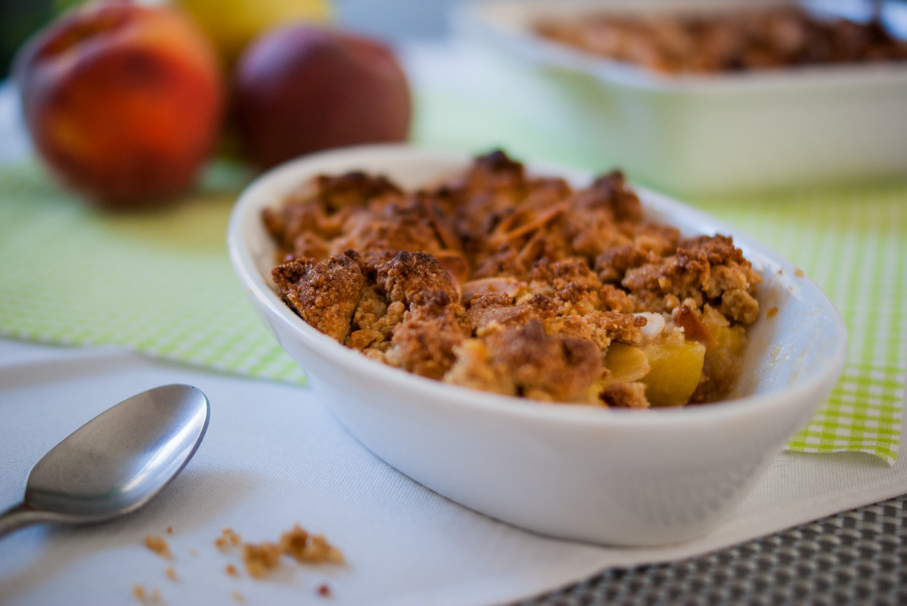

# Crumble aux amandes et aux pommes
(sans glutten, sans lactose et sans oeuf)  

(sans glutten, sans lactose et sans oeuf)  

## Ingrédients
Pour 6 à 8 personnes

    6 à 8 pommes (ou plus si vous aimez le crumble avec beaucoup de fruits)
    150g de cassonade (ou à défaut du sucre de canne) + quelques cuillères pour saupoudrer vos fruits
    75g d'amande en poudre
    150g de farine de riz
    50g d'amandes effilées
    125g de beurre végétal habituel demi sel (à défaut il vous faudra ajouter une pincée de sel) + quelques cuillères pour faire dorer vos fruits ;

## Recette
L'avantage du Crumble c'est qu'il n'y a pas besoin d'œuf dans la recette et remplacer la farine et le beurre, c'est ce qu'il y a de plus simple. En plus, le crumble se déguste à toutes les saisons. Faites-vous plaisir et variez les saveurs avec les pommes et les poires en hivers et les pêches, abricots, nectarines et autres fruits rouges en été.

Allumez votre four à 180°. Épluchez les pommes, coupez-les en petit cubes et mettez-les dans votre plat à tarte. Saupoudrez les de sucre et ajouter un peu de beurre. Faites cuire une vingtaine de minutes au four. Pendant ce temps dans un récipient, mélangez la farine, le sucre et la poudre d'amande. Ajoutez ensuite votre beurre en petits morceaux et sablez la pâte avec vos doigts. Ajoutez enfin les amandes effilées. Malaxez de nouveau le tout pour obtenir une pâte sableuse. Réservez au frais le temps que vos fruits dorent un peu au four. Egrainez la pâte sur les fruits et enfournez pour 30 minutes. Vérifiez la cuisson, le crumble doit être bien doré.

> Astuce : Si vous pouvez vous le permettre, saupoudrez vos fruits de vanille ou de cannelle, c'est encore meilleur.
