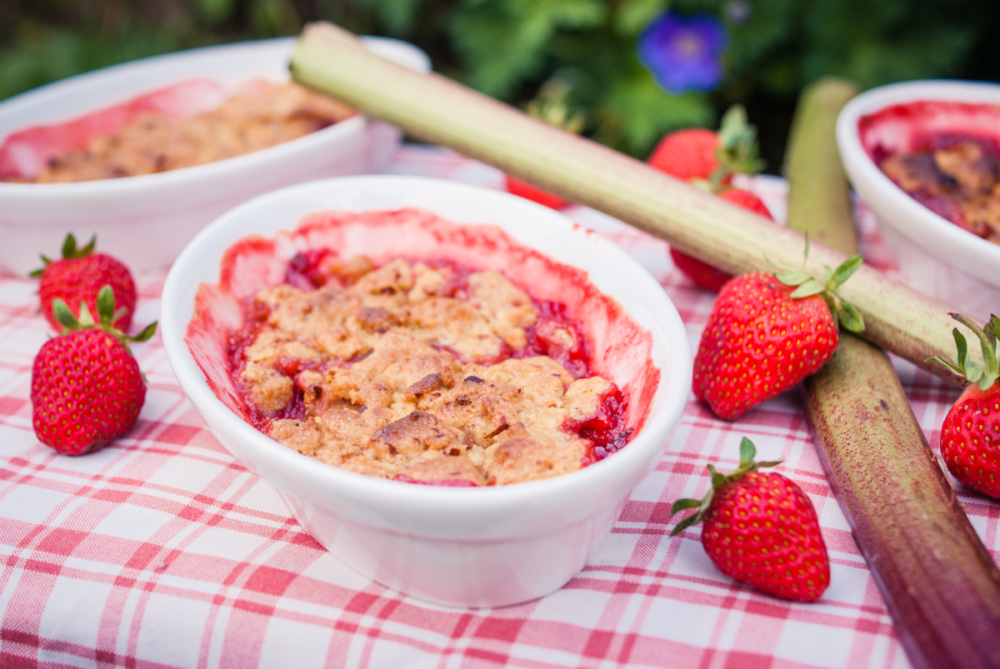

# Crumble aux fraises et à la rhubarbe
(sans glutten, sans lactose et sans oeuf)  

## Ingrédients
Pour 6 personnes

    400g de fraises lavées et équeutées
    400g de rhubarbe lavée et pelée
    150g de cassonade
    40g de sucre de canne
    80g d’amande en poudre
    150g de farine de maïs
    125g de beurre végétal demi sel (à défaut il vous faudra ajouter une pincée de sel) + 1CàS pour faire fondre la rhubarbe

## Recette
Cette recette de crumble est une variante de celle que je vous avais proposée aux tous débuts de l’aventure Intolérante et alors. Pour ce crumble qui mélange la douceur des fraises et l’acidité de la rhubarbe, j’ai choisi une farine de maïs qui rend cette recette de saison très gourmande.

Commencez par laver les tiges de rhubarbe et épluchez-les en enlevant la peau et les filaments. Coupez-les ensuite en petits tronçons que vous ferez revenir dans une casserole avec 1 CàS de beurre végétal et 40g de sucre de canne. Pendant ce temps, lavez et équeutez vos fraises. Coupez-les en 2 (ou en 4 si elles sont très grosses). Quand la rhubarbe devient tendre enlevez-les du feu et ajoutez les fraises. Mélangez bien pour que les arômes se mêlent. Réservez.
Allumez votre four à 180°.
Dans un récipient, mélangez la farine, la cassonade et la poudre d’amande. Ajoutez ensuite votre beurre mou et sablez la pâte avec vos doigts pour obtenir une pâte sableuse et granuleuse.
Répartissez vos fruits dans 6 plats individuels allant au four (ou à défaut dans un plat familial) et égrainez la pâte sur les fruits et enfournez pour une vingtaine de minutes. Vérifiez la cuisson, le crumble doit être bien doré.

> Astuce : Pour varier les plaisirs, découvrez ou redécouvrez toutes mes recettes de crumbles : 
> - [tarte rhubarbe amandine en crumble](./Tarte-rhubarbe-amandine-en-crumble.md)
> - [cobbler aux prunes](./Cobbler-aux-prunes.md)
> - [tarte crumble à la rhubarbe](./Tarte-crumble-a-la-rhubarbe.md)
> - [Gâteau crumble à la framboise](./Gateau-crumble-a-la-framboise.md)
> - [Crumble aux amandes et aux pommes](./Crumble-aux-amandes-et-aux-pommes.md)
