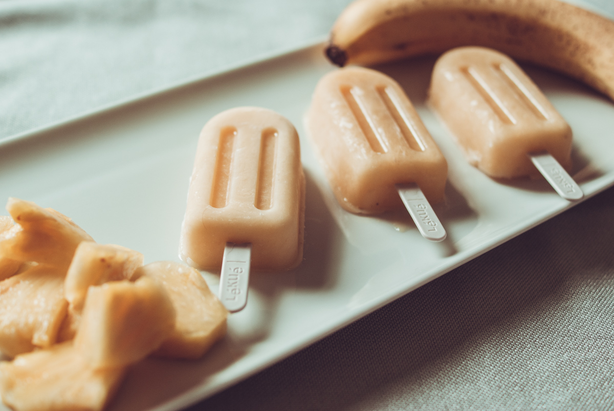

# Esquimaux ananas et banane
(sans glutten, sans lactose et sans oeuf)  

## Ingrédients
Pour 6 à 8 parts (selon la taille de vos moules)

    2 bananes
    200g d'ananas
    1 yaourt végétal nature (ici au lait de coco)
    2 CàS de sucre glace (facultatif)

## Recette
Il fait chaud et pour se désaltérer rien de mieux qu'une bonne glace aux fruits faite maison. En plus c'est possible sans sorbetière. Aussi rapide à faire qu'à dévorer.

Epluchez vos fruits et coupez-les en petits morceaux. Passez le tout au mixer avec votre yaourt végétal et le sucre glace. Versez dans vos moules et placez au congélateur pendant 6/8 heures.

> Astuce : Si vous souhaitez sucrer votre glace vous pouvez remplacer le sucre glace par du miel ou du sirop d'agave. Pour varier les plaisirs vous pouvez utiliser le mélange de fruits de votre choix.
