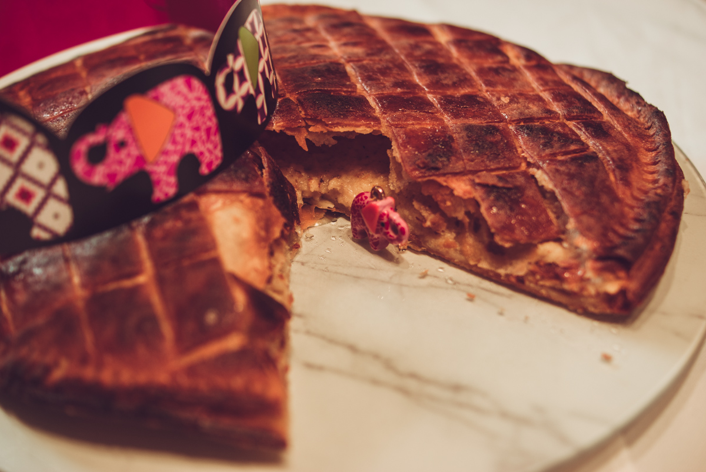

# Galette des rois à la crème frangipane
(sans glutten, sans lactose et sans oeuf)  

## Ingrédients
Pour une galette de 6 à 8 personnes

2 pâtes feuilletées sans gluten (et vegan)
### Pour la crème pâtissière

    20g de farine de riz
    15g de fécule de pomme de terre
    25cl de lait végétal
    25g de sucre en poudre
    1 càc de purée d'amandes blanche
    Vanille en gousse ou en poudre
    
### Pour la frangipane

    150g de poudre d'amandes
    1CàS de fécule de pomme de terre
    150g de beurre végétal fondu
    50g de sucre
    Quelques gouttes d'amande amère (facultatif)
    50ml d'amande cuisine

### Pour la dorure

    2 CàS de beurre végétal fondu
    2 CàS de sucre glace

    1 fève
    1 couronne

## Recette
Tous les ans nous l'attendons avec impatience, la galette des rois. Qu'elle soit à la frangipane, aux pommes ou encore au chocolat, elle fait le bonheur des petits et des grands. Cependant, en déguster une part sans gluten, sans lactose et sans œufs devient vite un calvaire.  Je vous propose de découvrir ma recette de galette, une pâte feuilletée cachant un fourrage crème pâtissière et frangipane. Comme la pâte feuilletée sans gluten est très dure à faire maison, on triche un peu et on l'achète. Vous pouvez en trouver facilement en magasin bio et maintenant aussi dans beaucoup de grandes surfaces. Alors, à vos fèves et vos couronnes et bonne épiphanie.

Commencez par réaliser la crème pâtissière. Mélangez la farine et la fécule dans un saladier. Délayez avec un peu de lait puis ajoutez le sucre, la purée d'amande et mélangez.
Dans une casserole, faites chauffer le reste du lait avec une demi-gousse de vanille à infuser ou de la vanille en poudre. Avant ébullition, ajoutez progressivement le lait à votre préparation en fouettant. Remettez le tout dans la casserole et continuez de fouetter à feu doux.
Lorsque la crème a correctement épaissi, transvasez-la dans un bol. Placez un film étirable au contact de la crème pour éviter la formation d'une pellicule de peau.
Réservez au réfrigérateur jusqu'à utilisation.
Réalisez ensuite la frangipane. Dans un saladier mélangez la poudre d'amandes, le sucre et la fécule de pomme de terre. Ajoutez le beurre fondu et l'amande amère, mélangez bien et ajoutez enfin l'amande cuisine (ou une crème de cuisine végétale au soja). Mélangez bien et ajoutez à cette préparation votre crème pâtissière. Mélangez le tout et réservez.
Faites préchauffer votre four à 180°.
Étalez le premier disque de pâte feuilletée sur une plaque préalablement beurrée (ou mettre le disque sur du papier sulfurisé). Garnissez la pâte avec votre préparation à la crème et frangipane en l'étalant de façon régulière (attention, laissez une marge d'environ 1,5 cm au bord de la pâte). Glissez la fève dans la garniture. Humidifiez le rebord de la galette avec un peu d'eau. Refermez la galette avec le second disque de pâte feuilletée en appuyant sur toute la bordure avec une fourchette, cela formera un motif. A l'aide d'une pointe de couteau réalisez un motif sur le dessus de votre pâte. Badigeonnez enfin votre galette de beurre fondu et saupoudrez de sucre glace pour obtenir un beau glaçage.
Enfournez pour 35 minutes environ.
N'oubliez pas de désigner votre roi ou votre reine si vous tombez sur la fève.

> Astuce : Vous aimez la galette des rois mais vous avez envie de changer un peu? [C'est par ici](./galette-rois-a-frangipane-poire-chocolat) ;)
