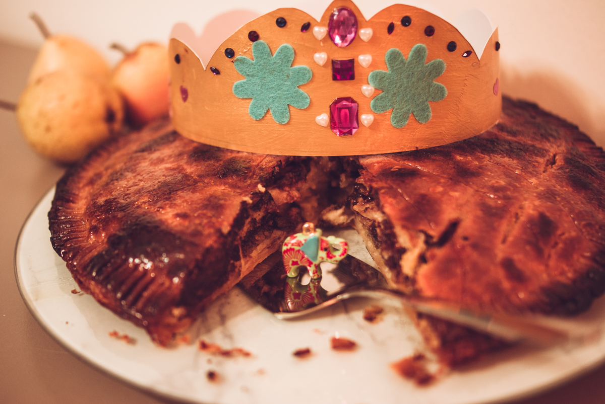

# Galette des rois à la frangipane, poire et chocolat
(sans glutten, sans lactose et sans oeuf)  

## Ingrédients
Pour une galette de 6 à 8 personnes

    2 pâtes feuilletées sans gluten (et vegan)
    200g de poudre d’amandes
    1CàS de fécule de pomme de terre
    150g de beurre végétal fondu
    50g de sucre
    Quelques gouttes d’amande amère (facultatif)
    50ml d’amande cuisine
    100g de pépites de chocolat noir
    3 poires

### Pour la dorure
    
    2 CàS de beurre végétal fondu
    2 CàS de sucre glace
    
    
    1 fève
    1 couronne

## Recette
Comme l’année dernière, je vous propose de découvrir une recette de galette des rois, sans gluten, sans lactose et sans œuf. Pour changer un peu cette année, je vous propose une association que j’adore : la frangipane avec de la poire et du chocolat.
Pour la pâte feuilletée sans gluten, pas de panique, on en trouve facilement : en magasin bio bien sûr mais aussi de plus en plus en supermarché.

Allumez votre four à 180°.
Commencez par réaliser la frangipane au chocolat. Dans un saladier mélangez la poudre d’amandes, le sucre et la fécule de pomme de terre. Ajoutez le beurre fondu et l’amande amère, mélangez bien et ajoutez enfin l’amande cuisine (ou une crème de cuisine végétale au soja). Mélangez bien et ajoutez 50g de pépites de chocolat. Mélangez le tout et réservez.
Etalez le premier disque de pâte feuilletée sur une plaque recouverte de papier cuisson. Garnissez la pâte avec votre préparation à la crème et frangipane au chocolat en l'étalant de façon régulière (attention, laissez une marge d'environ 1,5 cm au bord de la pâte). Glissez la fève dans la garniture.
Lavez et épluchez vos poires. Coupez-les en fines lamelles et répartissez-les en rosace sur la frangipane.  Humidifiez le rebord de la galette avec un peu d’eau. Refermez la galette avec le second disque de pâte feuilletée en appuyant sur toute la bordure avec une fourchette, cela formera un motif. A l’aide d’une pointe de couteau réalisez un motif sur le dessus de votre pâte.
Dans un bol faites fondre 2 CàS de beurre végétal et ajoutez-y le sucre en poudre. Badigeonnez votre galette pour obtenir un beau glaçage. Si vous avez trop de beurre fondu, badigeonnez le reste sur la galette 5 minutes avant la fin de la cuisson.
Enfournez pour 30 minutes environ. Dégustez tiède ou froid.
N’oubliez pas de désigner votre roi ou votre reine si vous tombez sur la fève.

> Astuce : Et si vous préférez [la galette traditionnelle](./Galette-des-rois-a-la-creme-frangipane.md)
