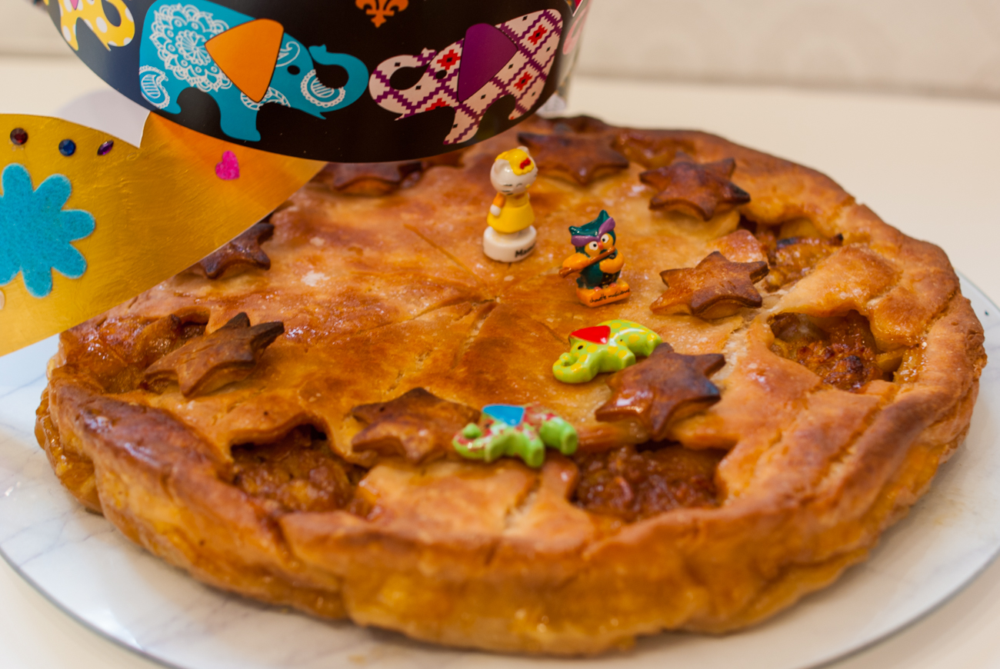

# Galette des rois pommes et caramel
(sans glutten, sans lactose et sans oeuf)  

## Ingrédients
Pour 8 personnes

    2 pâtes feuilletées sans gluten (et vegan)
    6 pommes
    200g de sauce caramel vegan
    1 CàS de beurre végétal
    Du sucre glace
    
    1 fève et une couronne

## Recette
Les débats font rage pour déterminer LE parfum officiel de la galette des rois : qui de la frangipane, de la pomme, de la poire chocolat ou de la yuzu myrtilles (si si) emportera le prix, ce n’est pas à moi de le dire. Comme jusqu’alors je ne vous ai proposé que des galettes à la frangipane, il est temps de penser aux amateurs de pommes. Il en faut pour tous les goûts après tout… Voici donc une version aux pommes et caramel qui, sans vouloir me lancer de fleurs, est vraiment délicieuse. Peut-être que cette association permettra de clore le débat, qui sait ?

Si vous n’avez pas de [sauce caramel](../desserts/Sauce-caramel-vegan.md) de préparée à l’avance, commencez par la faire pour qu’elle refroidisse un peu. 
Allumez votre four à 200°.
Ensuite lavez et épluchez vos pommes. Epépinez les et coupez-les en fines lamelles. Pour plus de facilité avec la pâte feuilletée sans gluten et par peur que le caramel ne coule partout, j’ai utilisé un moule à tarte pour réaliser ma galette. Je l’ai montée comme une tourte, à l’américaine. Foncez donc votre moule avec une pâte feuilletée et garnissez-la avec vos pommes finement coupées en lamelles. Placez votre fève dans les pommes et répartissez votre caramel. Déroulez votre deuxième pâte et à l’aide d’un emporte-pièce de votre choix réalisez un décor. La pâte ainsi percée, l’humidité des pommes s’évacuera à la cuisson. Recouvrez votre tarte de cette deuxième pâte et soudez bien les bords en pinçant avec vos doigts. Vous pouvez décorer le dessus de votre galette avec les morceaux de pâte que vous avez « emporte-piécé ».  Pour une galette bien dorée, faites fondre une CàS de beurre végétal et badigeonnez le dessus de votre galette puis saupoudrez de sucre glace.
Mettez au four pour 40 minutes.
A déguster tiède ou à température ambiante.
Si vous tombez sur la fève n’oubliez pas de choisir votre roi ou votre reine.

> Astuce : Si vraiment vous préférez la frangipane, [c'est par ici](./Galette-des-rois-a-la-creme-frangipane.md).
