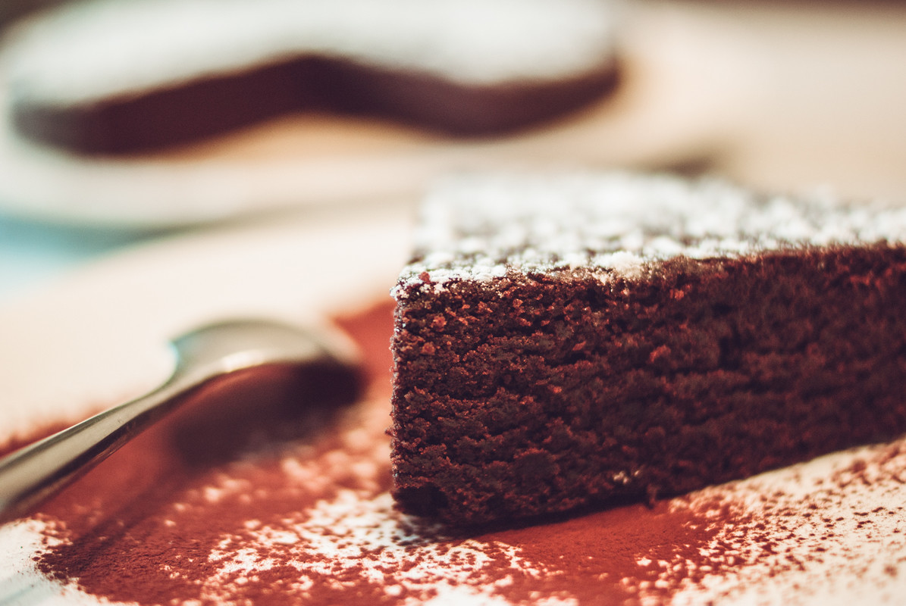

# Gâteau au Chocolat 
(sans glutten, sans lactose et sans oeuf)  

## Ingrédients
Pour un moule de 22 cm de diamètre

    195g de farine de riz
    200g de sucre
    3 CS de cacao en poudre non sucré
    1 càc de votre poudre à lever sans gluten habituelle
    1 pincée de sel
    7,5 cl d'huile végétale (de préférence une huile neutre comme l'huile de pépin de raisin)
    250g de lait végétal (ma préférence pour cette recette va au lait d'amande)

## Recette
Qui n'aime pas le gâteau au chocolat ? Que ce soit pour le dessert, pour un petit encas ou pourquoi pas pour le petit déjeuner, cette recette de gâteau au chocolat fera certainement des heureux. Pour cette recette, je me suis inspirée du célèbre crazy wacky cake canadien. Et vous allez voir, il n'y a rien de plus simple que ce soit dans la réalisation ou pour les ingrédients.

Préchauffez votre four à 180°C. Commencez par mélanger tous les ingrédients secs dans un récipient. Ajoutez ensuite le lait d'amande ainsi que l'huile. Mélangez le tout jusqu'à obtention d'une pâte lisse et homogène. N'ayez pas peur, celle-ci est un peu liquide. Versez cette préparation dans votre moule préalablement huilé. Enfournez pour environ 25/30 minutes. Vérifiez la cuisson avec la pointe d'un couteau.

> Astuce : Si vous pouvez vous le permettre ajoutez de la vanille à la pâte, c'est encore meilleur. Pour plus de gourmandise, garnissez votre gâteau : ganache au chocolat, sucre glace, fondant, glaçage…
