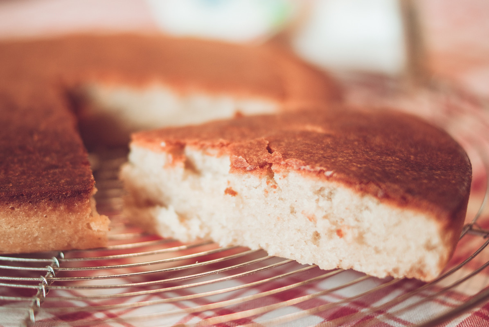

# Gâteau au yaourt de soja
(sans glutten, sans lactose et sans oeuf)  

## Ingrédients
Ingrédients pour un moule de 22 cm de diamètre

    2 yaourts nature au soja
    2 pots de sucre
    ½ pot de fécule de pomme de terre
    2 pots ½ de farine de riz
    1 pot d'huile
    1 càc de poudre à lever sans gluten

## Recette
En pâtisserie qui ne connait pas le célèbre gâteau au yaourt des familles ? Impossible à rater il plaît à tout le monde. La bonne nouvelle du jour c'est que l'on peut le réaliser sans gluten, sans œuf et sans lactose et il est tout aussi moelleux et régressif que l'original.

Tout le monde le sait déjà, mais rappelons quand même que le pot de yaourt vide sert de mesure pour l'ensemble des ingrédients de la recette.

Préchauffez votre four à 180°C
Commencez par mélanger les yaourts au soja et le sucre. Ajoutez la fécule, la farine et la poudre à lever, mélangez. Ajoutez enfin le pot d'huile. (En pâtisserie, j'utilise toujours de l'huile de pépin de raisin car je trouve que son goût est neutre). Mélangez jusqu'à obtention d'une pâte lisse et homogène. Versez la pâte dans votre moule préalablement graissé et enfournez pour 30 minutes.
Le gâteau au yaourt sans gluten, sans lactose et sans œufs va moins lever qu'une recette avec des œufs et du gluten, c'est normal mais il sera tout aussi moelleux.

> Astuce : N'hésitez pas à aromatiser votre gâteau avec de la vanille, de la fleur d'oranger ou encore du rhum. Quand j'étais enfant et que je réalisais ce gâteau j'aimais utiliser des yaourts aromatisés aux fruits car on retrouve le goût très léger après la cuisson. Vous pouvez également ajouter des pépites de chocolat ou pourquoi pas des dés de fruits (pommes, poires, bananes…) à votre pâte.
