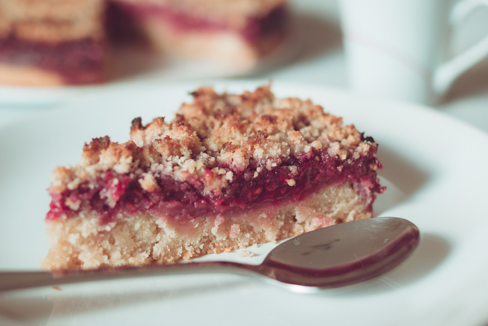

# Gâteau crumble à la framboise
(sans glutten, sans lactose et sans oeuf)  

## Ingrédients
Pour un plat à tarte de 23/24 cm de diamètre
Soit 6 personnes

### Pour le gâteau
    140g de beurre végétal (+ pour beurrer le plat à tarte)
    110g de sucre
    220g de farine de riz
    6 CàS de compote

### Pour les framboises
    500g de framboises
    4 CàS de sucre en poudre

### Pour le crumble
    45g de farine de riz
    45g d'amande en poudre
    50g de beurre
    50g de sucre

## Recette
Avec cette recette à la fois moelleuse et croustillante, je vous propose un pur moment de douceur sucré. Une recette si simple qu'il n'y a aucune excuse pour ne pas la réaliser maintenant.

Préchauffez votre four à 180°C.
Commencez par préparer le gâteau. Dans un saladier, mélangez le beurre végétal ramolli, la farine, le sucre et la compote jusqu'à obtention d'une pâte souple et homogène. Versez le tout dans votre plat à tarte préalablement beurré. Enfournez le tout pour 15 minutes.

Pendant ce temps préparez votre compotée de framboises. Dans un bol écrasez grossièrement les framboises avec le sucre. Réservez.

Continuez avec le crumble. Dans un saladier, mélangez la farine, la poudre d'amandes, le beurre et le sucre. Mélangez avec les doigts jusqu'à obtention de « miettes » de pâte.

Une fois votre fond de gâteau précuit déposez y votre compotée de framboises puis éparpillez sur le dessus le crumble. Enfournez de nouveau pour 35 minutes. Surveillez la cuisson, le crumble doit être bien doré.
