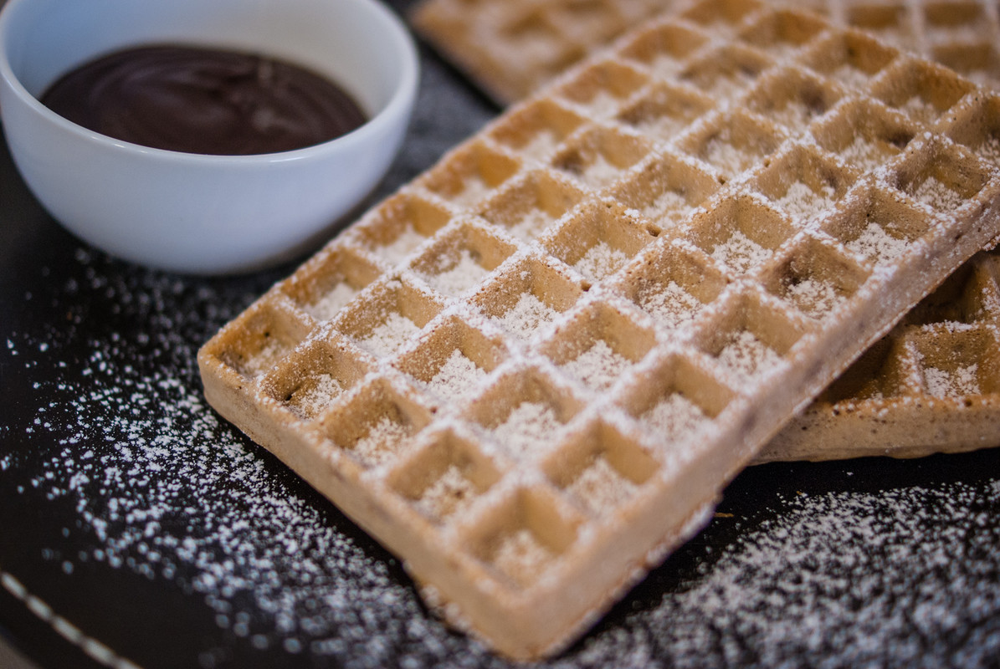

# Gaufres à la farine de châtaignes
(sans glutten, sans lactose et sans oeuf)  

## Ingrédients
Pour 6 belles gaufres

    150g de farine de riz
    40g de farine de châtaignes
    20g de fécule de pomme de terre
    50g de sucre
    1 càc de votre levure chimique habituelle
    40g de beurre végétal
    290g de lait d'amande

## Recette
Des gaufres sans gluten, sans lactose et sans œuf…. Et oui, c'est possible. Je vous propose ici une recette au goût subtil de châtaigne. Elles s'accommodent très bien avec du chocolat pour le goûter ou du sirop d'érable, de la confiture ou encore du miel pour le brunch ou le petit déjeuner.

Mélangez tous les ingrédients secs dans un récipient. Ajoutez ensuite le beurre fondu puis le lait progressivement jusqu'à obtention d'une pâte lisse.
Faites chauffer votre appareil à gaufres. Une fois chaud versez une louche de pâte et laissez cuire. Renouvelez l'opération pour cuire toutes les gaufres.

> Astuce : Pour une recette de pâte à tartiner choco-noisettes, [c'est par ici](./Pate-a-tartiner-choco-noisettes.md)
