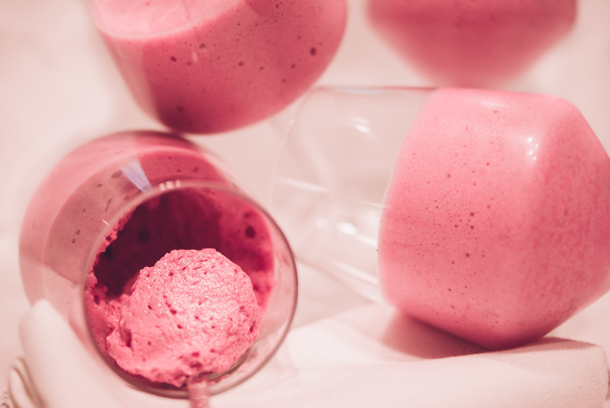

# Mousse à la framboise
(sans glutten, sans lactose et sans oeuf)  

## Ingrédients
Ingrédients pour 10 à 12 personnes

    150 g de jus de pois chiche
    300 g de framboises
    80 g de sucre
    4 feuilles de gélatine
    50 g de beurre de cacao
    ½ càc de vanille en poudre

## Recette
Cela n'est plus vraiment la saison des framboises mais j'avais envie de participer à octobre rose à ma façon avec un dessert à la fois léger, doux et fruité. Cette mousse, très framboise est bien sûr sans œufs et sans lactose. Une mousse sans monter des blancs d'œufs en neige ? Oui c'est possible.

Commencez par mettre les feuilles de gélatine à tremper dans l'eau froide.
Pour obtenir le jus de pois chiche, rien de plus simple. Il vous suffit d'ouvrir une boite de pois chiches et d'en garder le jus. (Pour 150g de jus il vous faudra une boite de 400g). Ce jus est de la protéine, à l'image des blancs d'œufs, il montera quand vous le battrez. Cependant, soyez patients, le jus de pois chiche met plus de temps à monter mais il deviendra aussi blanc et mousseux que des blancs d'œufs. Ne soyez pas surpris, votre mousse blanche sera cependant moins ferme.
Battez votre jus de pois chiche et réservez.
Mettez les framboises dans une casserole avec le sucre en poudre et la vanille (ce n'est plus la saison des framboises alors, j'utilise des framboises entières congelées). Ecrasez grossièrement les framboises et remuez jusqu'à ce que les framboises et leur jus soient chauds. Essorez ensuite les feuilles de gélatine et incorporez-les au mélange. Mélangez jusqu'à ce que les feuilles de gélatine soient fondues.
Faites fondre le beurre de cacao au bain marie. Ajoutez le ensuite aux framboises chaudes. A l'aide d'un mixeur plongeur, émulsionnez ce mélange pendant environ 1 minute. Les framboises vont devenir mousseuses et blanchir. Versez cette préparation sur votre mousse blanche au jus de pois chiche et mélangez délicatement.
Répartissez votre mousse dans vos verrines de présentation et réservez plusieurs heures au frais avant de déguster.
