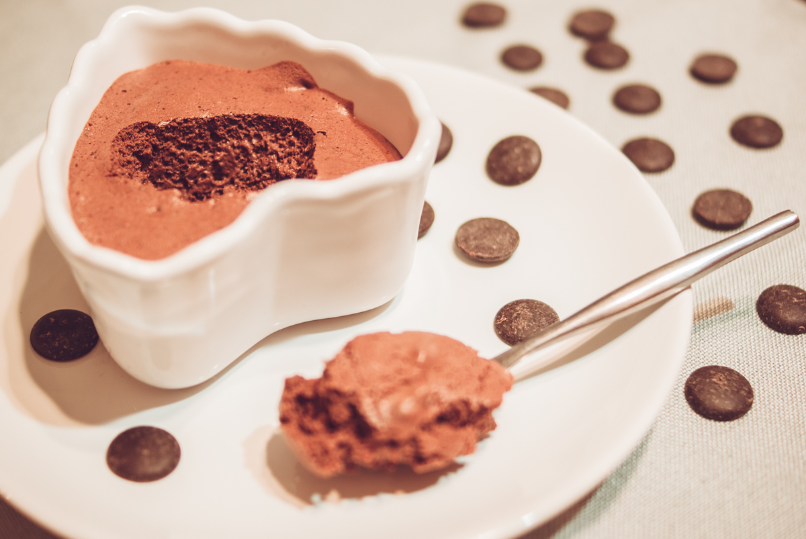

# Mousse au chocolat Vegan à l'aquabafa
(sans glutten, sans lactose et sans oeuf)  

## Ingrédients
Pour 6 personnes

    200g de jus de pois chiche (le jus d'une grande boite)
    200g de chocolat noir
    1 càc d'huile de coco
    Sucre glace (facultatif)

## Recette
Vous rêvez d'une mousse au chocolat mais vous êtes intolérant/ allergique aux œufs ? Ne rêvez plus. Vous pouvez remplacer les œufs par de l'aquabafa. Mais qu'est-ce donc encore ? Rien de bien compliqué, rassurez-vous. L'aquabafa, est l'eau de cuisson d'une légumineuse, chargée en protéines, elle monte comme le blanc d'œuf. Personnellement, j'utilise le jus d'une boite de pois chiches. Et, pour ceux qui se posent la question, non, votre dessert n'aura pas le goût de pois chiches et oui ce sera mousseux à souhait. Alors… Vous me suivez dans cette recette aussi simple que magique ?

Commencez par récupérer le jus d'une boite de pois chiche et filtrez le. Pesez ce jus car il vous faudra la même quantité de chocolat.
Commencez par monter le jus de pois chiche en neige (comme vous le feriez avec des blancs d'œufs). L'aquabafa met un peu plus de temps à monter, mais cela monte très bien. Une fois le blanc monté, ajoutez du sucre glace si vous le souhaitez. Personnellement, j'aime la mousse forte en chocolat, je n'en mets donc pas mais si vous l'aimez un peu plus sucrée, n'hésitez pas en mettre quelques cuillères à soupe puis battez de nouveau le blanc pour bien incorporer le sucre.
Faites ensuite fondre votre chocolat au bain marie avec l'huile de coco. Puis incorporez-le délicatement au blanc. Déposez ensuite votre mousse dans votre plat de présentation ou dans des coupes individuelles et laissez poser au frais au moins 1 heure.
Le plus dur ? Patienter avant de déguster.
