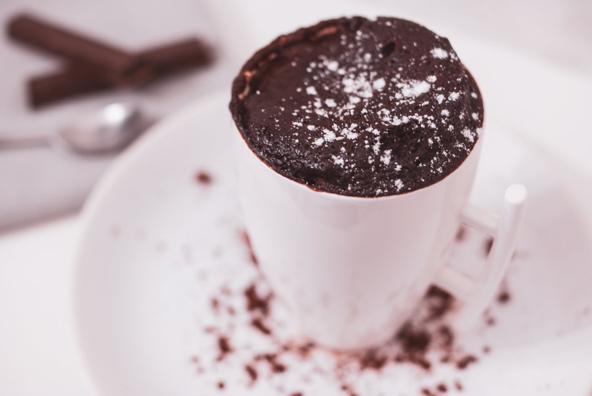

# Mug cake chocolat noir et banane
(sans glutten, sans lactose et sans oeuf)  

## Ingrédients
Ingrédients pour 2 personnes

    1 banane
    6 CàS de farine de riz
    6 CàS rases de cacao en poudre non sucré
    4 pincées de levure chimique sans gluten
    4 CàS de sirop d'érable
    8 CàS de lait végétal
    1 pincée de sel (facultatif)

## Recette
Vous avez des invités qui arrivent à l'improviste et vous voulez leur faire plaisir avec un gâteau au chocolat ? C'est l'heure du goûter et vous avez envie de vous faire plaisir sans attendre ? Vous voulez une recette simple et rapide ? J'ai ce qu'il vous faut. La recette que je vous partage aujourd'hui est tirée du livre « les recettes d'une connasse » de Fiona Schmidt et c'est devenu LE goûter que ma fille me réclame presque tous les jours.

Dans un bol, écrasez la banane. Ajoutez ensuite tous les ingrédients secs : farine, cacao, levure et sel. Mélangez bien et ajoutez ensuite le lait et le sirop d'érable. Mélangez de nouveau pour obtenir une texture homogène.
Répartissez la pâte dans deux mug et laissez cuire 2 à 3 minutes au micro-ondes. Laissez d'abord cuire 2 minutes et vérifiez la cuisson. Le mug cake est aussi bon avec le cœur coulant ou bien cuit. Adaptez donc le temps de cuisson à vos préférences.
Laissez refroidir et dégustez.
