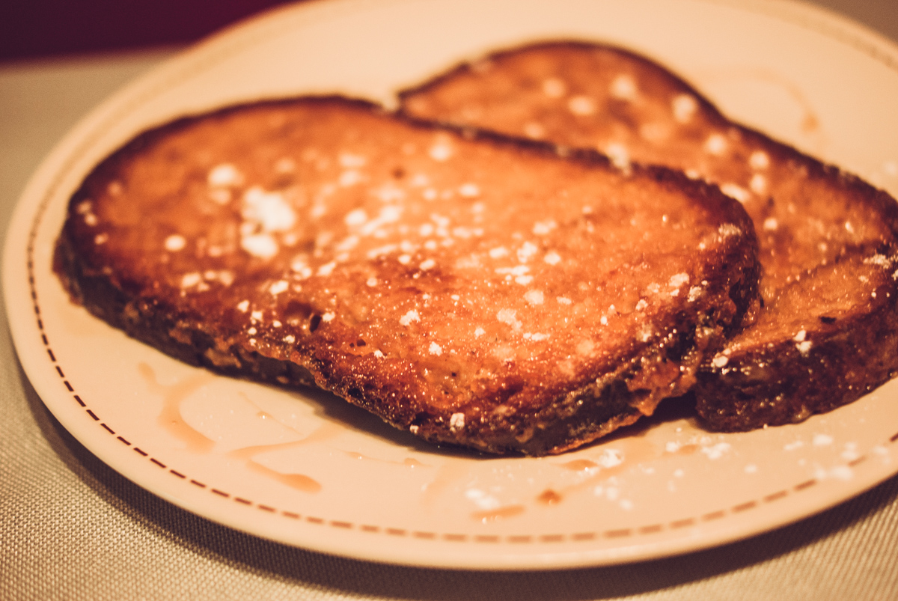

# Pain perdu vegan au lait de noisette
(sans glutten, sans lactose et sans oeuf)  

## Ingrédients
Ingrédients pour 4 personnes

    4 grandes tranches de pain sans gluten
    200ml de lait de noisette
    2 CàS de maïzena
    5 CàS de sucre
    4 CàS de beurre végétal

## Recette
Le pain perdu, qui n'aime pas ça ? Cette petite douceur si simple à réaliser est vraiment régressive mais, quand on est intolérant au gluten, au lactose et aux œufs, vous vous dites certainement qu'il faut vite l'oublier. Pas du tout ! Sortez tout de suite les poêles et appelez les gourmands !

Dans une assiette creuse, délayez la maïzena avec un peu de lait. Ajoutez et mélangez 1 CàS de sucre (facultatif, à doser selon votre goût) et le reste de lait.
Faites tremper les tranches de pain, sur les deux faces, jusqu'à ce qu'elles soient bien imbibées.
Dans une grande poêle, faire chauffer le beurre végétal. Faites dorer les tranches sur chaque face en saupoudrant de sucre en poudre, environ 1 CàS par grande tranche de pain. Une fois vos tranches dorées et caramélisées, dégustez chaud.

> Astuce : Vous pouvez utiliser le lait végétal de votre choix et l'aromatiser selon vos goûts : vanille, cannelle, fleur d'oranger… Servez et dégustez votre pain perdu saupoudré de sucre glace, arrosé de sirop d'érable, de coulis de caramel ou avec une boule de glace, des fruits frais….
