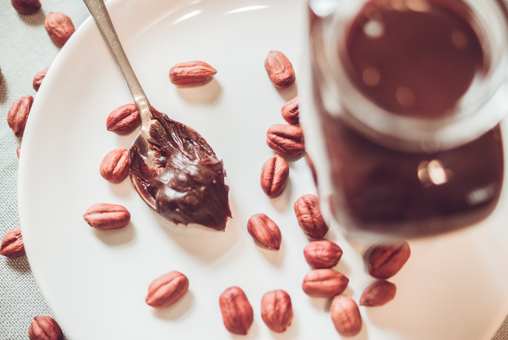

# Pâte à tartiner choco-noisettes 
(sans glutten, sans lactose et sans oeuf)  

## Ingrédients
Ingrédients pour 2 pots

    200g de chocolat noir
    200g de purée de noisettes
    150ml de lait végétal concentré (500ml de lait végétal à la noisette + 140g de sucre en poudre)
    100 ml de lait de noisettes.

## Recette
Tout le monde aime la pâte à tartiner au chocolat. Qu'elle soit au chocolat au lait, au chocolat noir, avec des noisettes… Une chose est sûre, faite maison elle est vraiment meilleure. Je vous propose aujourd'hui ma recette de pâte à tartiner choco-noisettes. Un régal testé et approuvé par ma petite famille.

Commencez par réaliser le lait concentré végétal. Si si c'est possible, avec beaucoup de patience. Dans une petite casserole mélangez le lait végétal et le sucre. Portez à ébullition en remuant. Baissez ensuite le feu et laisser à petite ébullition pendant 1h30 en remuant régulièrement. Le mélange va progressivement s'épaissir. Une fois la consistance souhaitée, c'est prêt. Vous pouvez retirer du feu et réserver pour la suite de la recette.
Faites fondre au bain marie le chocolat avec la purée de noisettes et le lait de noisettes. Une fois le mélange fondu ajoutez le lait concentré végétal. Mélangez bien. Conservez dans des bocaux hermétiques.
Comme cette pâte à tartiner ne contient que des ingrédients issus du végétal, elle se conserve plus longtemps qu'une pâte à tartiner maison qui contient des matières grasses animales. Cependant, comme nous sommes des gourmands, je ne peux vous dire si elle se conserve plus de 10 jours ;)

> Astuce : Vous pouvez utiliser n'importe quel lait végétal. Mes premières versions étaient avec du lait d'amandes. Le goût de noisettes sera cependant moins prononcé. Vous aimez beaucoup la noisette ? Mettez 100g de chocolat pour 300g de purée de noisettes.
