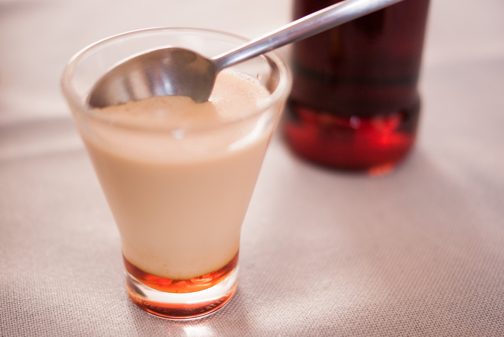

# Petits flans au caramel 
(sans glutten, sans lactose et sans oeuf)  

## Ingrédients
Pour 6 à 8 personnes

    400 ml de lait végétal
    200 ml d'amande cuisine (ou soja cuisine)
    50 g de sucre
    1 gousse de vanille
    1 sachet d'agar agar
    Caramel

### Pour le caramel
    1 cuillère à soupe de vinaigre
    500 g de sucre en poudre
    12,5 cl + 25 cl d'eau

## Recette
Le Flamby c'est LA crème caramel à démouler de notre enfance. Le problème est qu'ils sont faits avec du lait de vache. Pas de panique, la recette du Flamby est simplissime et ultra rapide. Le plus dur c'est d'attendre qu'ils refroidissent.

Commencez par préparer votre caramel.
Mettre le vinaigre + le sucre + 12,5 cl d'eau dans 1 casserole. Faites chauffer à feu vif environ 15 min.
Quand le caramel blondit, baissez un peu le feu et ajoutez très, très, très doucement 25 cl d'eau froide (attention aux éclaboussures). Refaire chauffer 1 min à feu vif.
Pour 500g de sucre, cela vous fera une grande quantité de caramel, vous en aurez ainsi pour vos prochaines recettes. Le caramel se conserve très bien au réfrigérateur, dans un bocal hermétique,  pendant plusieurs mois.

Réalisez ensuite vos petits flans.
Dans une casserole, versez le lait végétal, la crème de cuisine végétale, le sucre, les graines de la gousse de vanille (ainsi que la gousse), et l'agar agar. Mélangez le tout et faites chauffer, tout en remuant jusqu'à ébullition pendant trois minutes environ. (pour faire prendre l'agar agar)
Versez du caramel dans le fond de vos verrines, la quantité dépend de votre goût pour le caramel. Versez par-dessus la crème de flan. Faites prendre minimum 3 heures au froid.

> Astuce : 
> Vous avez peur de faire du caramel ? Achetez le tout prêt ;)
> Pour un petit goût subtil de noisettes, utilisez du lait de noisettes. Si vous aimez la noix de coco, utilisez du lait et de la crème de coco. Vous préférez le chocolat au caramel ? Pour le coulis de chocolat, faites fondre 100g de chocolat noir avec 10 cl de lait.
> Il existe [des pots](https://www.amazon.fr/Tala-Mini-moules-gel%C3%A9e-Multicolore/dp/B0036L5YGU) qui se démoulent comme les flambys.
> A défaut, réutilisez des pots de flamby préalablement lavés, et obturez le fond avec un morceau d'adhésif. Ou alors faites comme moi, utilisez des verrines. (Mais pas de démoulage possible)
