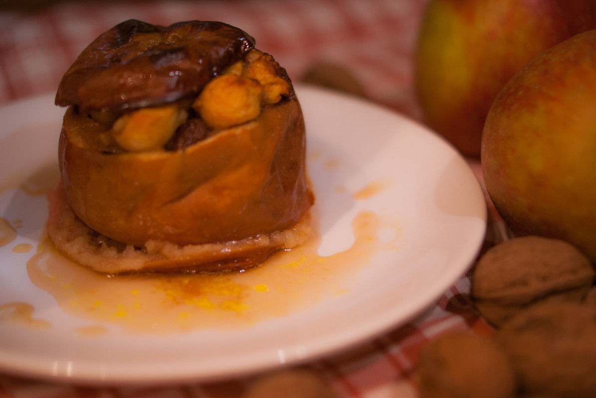

# Pommes farcies aux fruits secs, kaki et sirop d'érable
(sans glutten, sans lactose et sans oeuf)  

## Ingrédients
Ingrédients pour 6 pommes

    6 grosses pommes (boskoop)
    2 kakis
    50g d'airelles
    50g de raisins secs
    50g de noix concassées
    ½ cuillères à café de cannelle
    sirop d'érable
    beurre végétal

## Recette
Aujourd'hui, je vous propose une recette qui sent bon l'hiver, la neige (ou la pluie) qui tombe à travers la fenêtre, le thé sous le plaid et le feu dans la cheminée : des pommes farcies avec un autre fruit de saison, le kaki. A cela vous ajoutez des fruits secs pour le réconfort et du sirop d'érable pour la douceur sucrée. Et voilà un bon dessert fruité d'hiver.

Pour cette recette, j'ai choisi des pommes boskoop, j'aime leur chair acidulée. Mais si vous préférez plus de douceur, préférez des golden ou des jonagold.
Préchauffez votre four à 140°C.
Lavez les pommes puis coupez un chapeau sur le dessus, comme pour une tomate farcie. A l'aide d'un couteau pointu (ou d'un économe) et d'une cuillère parisienne, ôtez délicatement l'intérieur de la pomme en laissant un bord de 0,5 cm environ. Jetez le trognon, réservez la chair de 4 pommes et placez les pommes dans un plat allant au four. Pour que la peau des pommes n'éclate pas de façon aléatoire pendant la cuisson, fendez la légèrement, sur toute sa circonférence, à l'aide d'un couteau.  (Ne jetez pas la chair des 2 autres pommes, vous pourrez les utilisez pour faire une compote par exemple. Une idée à suivre dans les Astuces)
Préparez ensuite la farce. Mettez les morceaux de pomme dans un plat allant au micro-ondes et les faire (pré)cuire quelques minutes. Pendant ce temps lavez et pelez les 2 kakis. Coupez-les en petits cubes et mélangez-les aux pommes. Ajoutez, les airelles, les raisins secs et les noix finement concassées. Mélangez et ajoutez la cannelle et 6 CàS de sirop d'érable. Mélangez le tout.
Garnissez les pommes de farce, remettez leur chapeau. Déposez sur chaque pomme une noisette de beurre végétal et un filet de sirop d'érable. Versez environ 5 cl d'eau dans le fond de votre plat. (Avec le beurre végétal et le sirop d'érable, cela formera une petite sauce).
Enfournez pour 1h/1h30 (selon la taille des pommes). Plus la cuisson sera longue plus les pommes vont confire.
Servez tiède en accompagnant de sauce récupérée dans le fond du plat.

> Astuce : J'ai utilisé des noix de Grenoble, mais vous pouvez également utiliser des noix de pécan. De même vous pouvez remplacer la cannelle par de la vanille ou des épices à pain d'épice. Attention à ne pas trop en mettre pour ne pas cacher le goût des fruits. Avec la chaire de pomme restante, j'ai fait une compote en ajoutant une banane et 2 autres kakis. Pour une compote rapide, mettez les fruits coupés en morceaux dans un saladier allant au micro-ondes avec quelques CàS d'eau, couvrez et laissez cuire quelques minutes. Quand les fruits sont cuits, mixez-les. Votre compote est prête.
