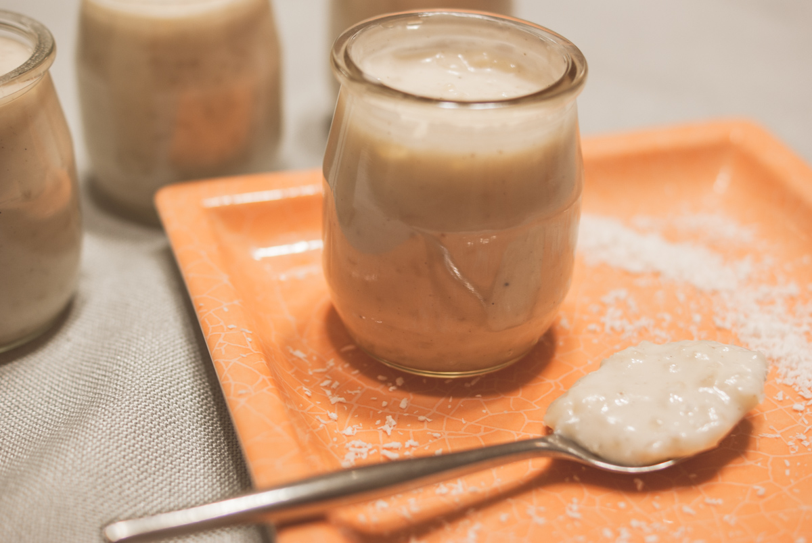

# Riz au lait de coco à la vanille
(sans glutten, sans lactose et sans oeuf)  

## Ingrédients
Ingrédients pour 6 portions

    110g de riz rond
    1 litre de boisson végétale à la coco
    25 à 50g de sucre (selon votre goût)
    20g de noix de coco râpée
    20cl de lait de coco
    1 gousse de vanille (ou vanille en poudre)

## Recette
Vous cherchez un dessert gourmand, régressif et simple à réaliser ? Optez pour un riz aux saveurs d'Asie, crémeux et doux grâce au lait de coco.

Mettez la boisson végétale à base de coco dans une casserole avec le sucre et la gousse de vanille fendue (grattez les graines et incorporez-les au liquide). Portez à ébullition en remuant. Une fois le mélange bien chaud, plongez le riz rond et laissez cuire jusqu'à absorption du liquide, environ 30 minutes. Votre riz doit être cuit et crémeux. Hors du feu ajoutez la coco râpée ainsi que le lait de coco. Mélangez. Retirez la gousse de vanille et répartissez dans vos ramequins. Servir bien frais.

> Astuce : Pour alléger votre dessert, utilisez du lait de coco allégé. Pour plus de gourmandise, accompagnez votre riz d'un coulis de mangue, de fruits exotiques, d'ananas ou encore de mangue fraîche … Laissez libre court à votre gourmandise.
