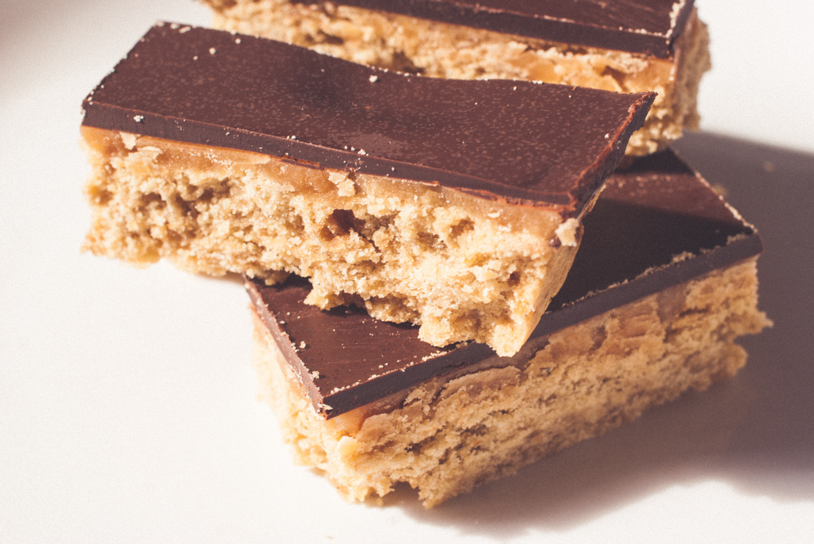

# Shortbread millionnaire
(sans glutten, sans lactose et sans oeuf)  

## Ingrédients
Ingrédients pour un plat carré de 20 x 20 cm

### Pour le shortbread

    250g de farine de riz
    50g de fécule de pomme de terre
    100g de muscovado (à défaut de la cassonade)
    200g de beurre végétal
    1 pincée de sel
    Vanille en poudre (selon votre convenance)

### Pour le caramel

    200g de sucre
    1 CàS de beurre végétal
    2 CàS de Soja cuisine semi épais
    1 pincée de sel

### Pour la couverture

    170g de chocolat noir
    1càc d'huile de coco

## Recette
Cela fait longtemps que je vois passer ces petites gourmandises sur les réseaux sociaux et autre blogs culinaires. J'avais donc envie d'essayer moi-même ces petites douceurs mais toujours sans gluten, sans lactose et sans œufs. Après quelques essais, j'ai enfin trouvé LA recette qui a plu à ma petite famille, gourmande, caramélisée et chocolatée à point. Attention, recette addictive.

Préchauffez votre four à 160°
Commencez par travailler ensemble le beurre végétal et le sucre jusqu'à obtenir une pommade. Ajoutez ensuite le sel, la vanille, la farine et la fécule. Formez une boule. Etalez la pâte ainsi obtenue dans votre moule. Pour un démoulage plus facile au moment de servir, placez au préalable, une feuille de papier cuisson dans le fond de votre moule.
Enfournez pour 25 minutes.
Une fois votre biscuit cuit, laissez refroidir.
Pendant de temps, réalisez le caramel.
Dans une grande casserole, mettez le sucre à caraméliser dans un peu d'eau. Une fois que le mélange a pris une belle couleur dorée, enlevez votre casserole du feu et ajoutez le beurre végétal en remuant. Attention aux éclaboussures de caramel. Ajoutez ensuite le soja cuisine et le sel. Remettez sur le feu et mélangez jusqu'à ce que le caramel nappe bien la cuillère.
Coulez votre caramel sur le biscuit et laissez figer.
Faites fondre votre chocolat avec l'huile de coco et nappez en votre caramel.
Une fois votre chocolat bien figé vous pouvez enlever votre shortbread millionnaire du moule à l'aide du papier sulfurisé. Coupez en petites bouchées individuelles. Attention à ne pas tout manger d'un coup.

> Astuce : Lorsque vous faites votre caramel (sucre + eau), plus vous le faites brunir, plus celui-ci sera fort et amer. Chacun ses goûts mais attention, si vous préférez un caramel + doux, arrêtez la cuisson avec le beurre végétal quand celui-ci est doré. Si vous le souhaitez, vous pouvez également parfumer votre caramel avec un peu de vanille. Si vous le tolérez, vous pouvez utiliser un chocolat au lait pour la couverture. Enfin, n'hésitez pas à mélanger les farines et switcher les variétés : riz + coco, riz + châtaignes, etc.
