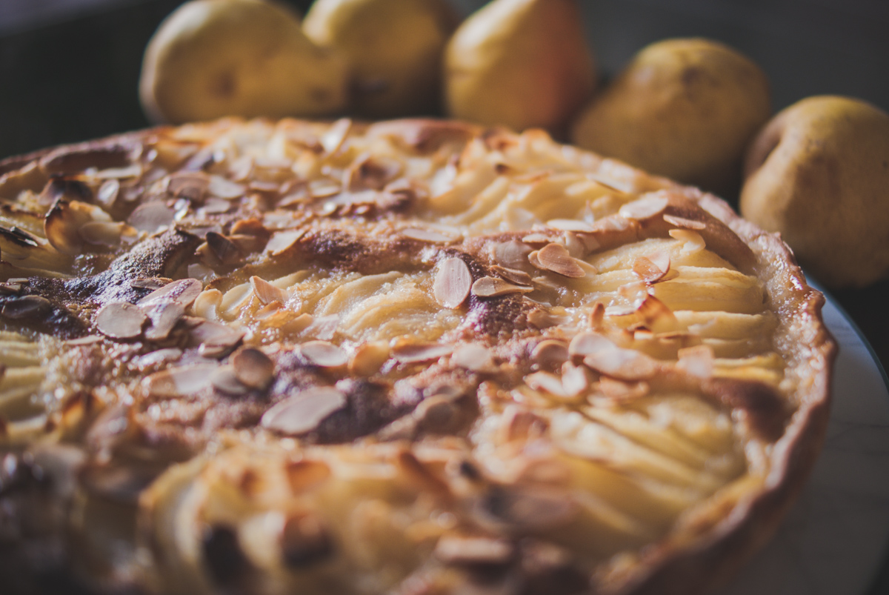

# Tarte Bourdaloue au sirop d’érable
(sans glutten, sans lactose et sans oeuf)  

## Ingrédients
Ingrédients pour 6 personnes

    1 fond de tarte sans gluten
    4 poires
    150g de poudre d’amandes
    1CàS de fécule de pomme de terre
    150g de beurre végétal fondu
    50g de sirop d’érable
    200ml d’amande cuisine
    Amandes effilées
    Sirop d’érable

## Recette
C’est la saison des poires et mon dessert préféré à la poire est la tarte Bourdaloue. Ce dessert parisien est composé de poires déposées sur un fond de tarte sucré et fourré à la crème d’amandes. Et vous savez quoi ? Il est facilement réalisable sans gluten, sans lactose et sans œuf. Aujourd’hui je vous propose une petite variante parfumée au sirop d’érable.

Faites chauffer votre four à 180°.
Préparez la crème d’amande en mélangeant la poudre d’amandes, la fécule, le beurre végétal fondu le sirop d’érable et l’amande cuisine.
Étalez la pâte sur votre moule et répartissez-y la crème d’amande en une couche régulière.
Lavez, épluchez et épépinez vos poires. Coupez vos poires en lamelles mais laissez les entières avant de les déposer en étoile sur la crème d’amande. Enfoncez-les légèrement, saupoudrez d’amandes effilées et versez un filet de sirop d’érable avant d’enfourner pour 35 minutes environ.
Dégustez tiède ou froid.
