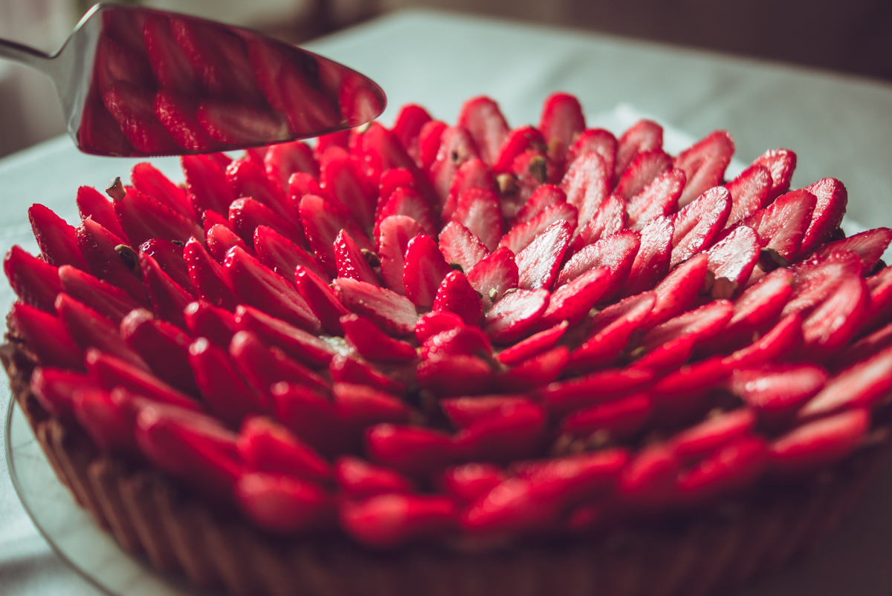

# Tarte aux fraises et crème de pistache
(sans glutten, sans lactose et sans oeuf)  

## Ingrédients
Pour un moule de 22cm de diamètre

### Pour la crème pâtissière à la pistache

    40g de farine de riz
    30g de fécule de pomme de terre
    50cl de lait végétal
    50g de sucre en poudre
    1 CàS de pâte de pistaches

### Pour la pâte sablée aux amandes

    200g de farine de riz
    50g de fécule de pomme de terre
    150g de beurre végétal tempéré
    100g de poudre d'amande
    50g de sucre en poudre
    5 à 6 CàS de lait végétal
    1 pincée de sel

### Pour la garniture

    1 à 2 CàS de gelée de fruits rouges
    750g de fraises
    Pistaches concassées

## Recette
Qui n'aime pas les fraises ? La saison est courte et il faut savoir en profiter. La tarte aux fraises est aussi un dessert incontournable qui plaît aux petits et grands gourmands. Je vous propose aujourd'hui de la préparer avec une pâte sablée et croustillante aux amandes et une crème pâtissière parfumée à la pistache.

Commencez par réaliser la crème pâtissière à la pistache. Mélangez la farine et la fécule dans un saladier. Délayez avec un peu de lait puis ajoutez le sucre, la purée d'amande et mélangez.
Dans une casserole, faites chauffer le reste du lait. Avant ébullition, ajoutez progressivement le lait à votre préparation en fouettant. Remettez le tout dans la casserole et continuez de fouetter à feu doux. Lorsque la crème a correctement épaissi, transvasez-la dans un bol. Placez un film étirable au contact de la crème pour éviter la formation d'une pellicule de peau.
Réservez au réfrigérateur jusqu'à ce qu'elle soit bien froide.
Réalisez ensuite votre pâte sablée. Dans une terrine (ou dans un robot muni d'une feuille), mettez la farine, la fécule, le sel, le sucre, la poudre d'amandes et le beurre tempéré. Mêlez le tout pour obtenir une texture sableuse. Ajoutez ensuite les cuillères à soupe de lait une à une jusqu'à obtenir une pâte que vous pourrez mettre en boule. Enveloppez-la dans un film alimentaire et réservez au frais pendant 2 heures.
Foncer un moule avec une pâte sans gluten et sans œuf est un peu délicat.
Prenez un papier cuisson et dessinez-y un cercle dont le diamètre est plus grand d'environ 5 cm que votre moule. A l'aide d'un rouleau à pâtisserie, abaissez votre pâte en suivant de cercle sur une épaisseur d'environ 3 à 4 mm. Placez ensuite votre pâte avec le papier cuisson dans votre moule à tarte. Appuyez délicatement afin de couvrir le fond et les bords de votre moule. Avec la pointe d'un couteau découpez les excédents de pâte. Avec des ciseaux, faites de même pour le papier cuisson. Si cette opération vous semble compliquée, vous pouvez aussi, graisser votre moule à tarte et étaler votre pâte à la main mais le résultat sera moins régulier. (C'est ce que je fais généralement, car c'est beaucoup plus simple et surtout plus rapide).
Faites cuire votre fond de tarte à blanc dans un four chaud à 180°C pendant environ 20 minutes. Surveillez la cuisson. Laissez refroidir votre fond de tarte.
Une fois votre pâte sablée froide, vous pouvez dresser votre tarte.
Commencez par étaler au pinceau une fine couche de gelée de fruits rouges sur votre fond de tarte pour lui donner un peu de peps. Répartissez ensuite, à l'aide d'une poche à douille (ou à la cuillère) la crème pâtissière à la pistache dans votre fond de tarte. Lavez, équeutez les fraises et coupez-les dans le sens de la longueur. Répartissez-les ensuite sur la crème. Servir bien frais.
