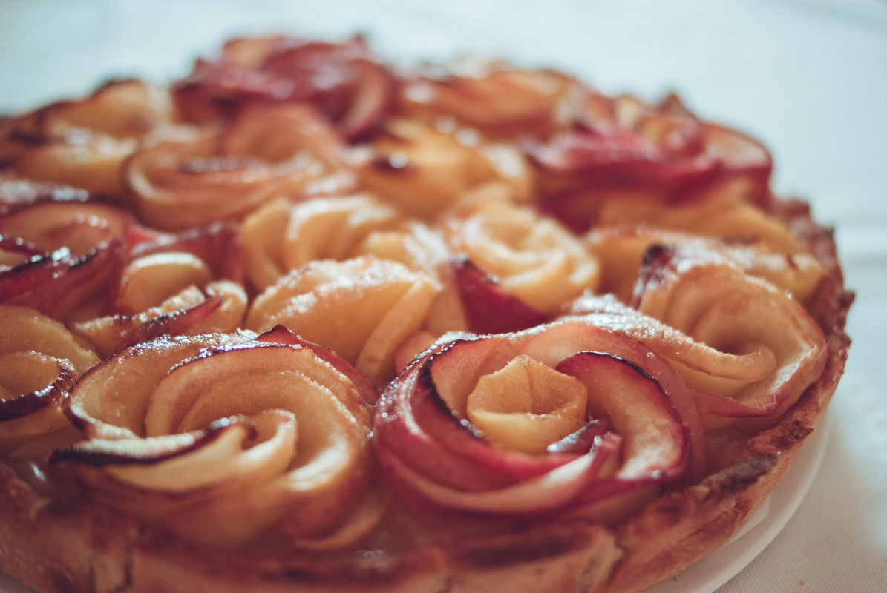

# Tarte aux pommes bouquet de roses
(sans glutten, sans lactose et sans oeuf)  

## Ingrédients
Pour un moule de 22 cm de diamètre

### Pâte sablée aux amandes
    250g de farine de riz
    150g de beurre végétal tempéré
    100g de poudre d'amande
    50g de sucre en poudre
    5 à 6 CàS de lait végétal
    1 pincée de sel

### Pour la garniture
    3 pommes pour la compote de pommes (+ 1 CàS de sucre en poudre)
    4 pommes pour les roses + le jus d'un demi citron
    2 CàS de beurre végétal fondu+ 1 CàS de sucre en poudre

## Recette
La tarte aux pommes c'est la star des desserts. Je vous propose aujourd'hui de la revisiter. Très à la mode en ce moment, la tarte bouquet de roses aux pommes est inspirée d'une recette du chef Alain Passard.

Commencez par préparer la pâte sablée aux amandes.
Dans un saladier (ou dans un robot muni d'une feuille), mettez la farine, le sel, le sucre, la poudre d'amandes et le beurre tempéré. Mélangez le tout pour obtenir une texture sableuse. Ajoutez ensuite les cuillères à soupe de lait une à une jusqu'à obtenir une pâte que vous pourrez mettre en boule. Enveloppez-la dans un film alimentaire et réservez au frais pendant 2 heures.

Préparez ensuite la compote de pommes. Épluchez et épépinez vos pommes. Coupez-les en petits morceaux et faites les réduire avec une cuillère à soupe de sucre (facultatif) et un peu d'eau. Une fois vos fruits cuits, passez-les au mixer pour avoir une texture lisse. (Vous pouvez aussi utiliser une compote de pommes déjà préparée).

Préparez ensuite vos pétales de roses. Pour cette étape, il ne faut surtout pas épluchez vos pommes. Lavez-les à l'eau froide avant de les couper en deux dans le sens de la hauteur. Enlevez ensuite les pépins. Coupez de fines lamelles, dans le sens de la largeur, d'environ 1mm d'épaisseur. N'hésitez pas à utiliser une mandoline en prenant garde à vos doigts (et je sais de quoi je parle).
Placez vos pétales de pommes dans une grande casserole avec le jus de citron et portez à ébullition pendant environ 5 minutes. Vos pétales doivent devenir « souples ». Égouttez-les et laissez tiédir.

Foncer un moule avec une pâte sans gluten et sans œufs est un peu délicat.
Prenez un papier cuisson et dessinez-y un cercle dont le diamètre est plus grand d'environ 5 cm que votre moule. A l'aide d'un rouleau à pâtisserie, abaissez votre pâte en suivant de cercle sur une épaisseur d'environ 3 à 4 mm. Placez ensuite votre pâte avec le papier cuisson dans votre moule à tarte. Appuyez délicatement afin de couvrir le fond et les bords de votre moule. Avec la pointe d'un couteau, découpez les excédents de pâte. Avec des ciseaux, faites de même pour le papier cuisson. Si cette opération vous semble compliquée, vous pouvez aussi, graisser votre moule à tarte et étaler votre pâte à la main mais le résultat sera moins régulier.
Faites précuire votre fond de tarte à blanc dans un four chaud à 200°C pendant 10 minutes

Procédez ensuite au montage de votre tarte. Préchauffez votre four à 200°C.
Dans le fond de tarte que vous aurez laissé tiédir, disposez la compote de pommes. Roulez ensuite vos pétales de pommes sur eux-même afin d'obtenir de petits boutons de fleurs que vous disposerez un à un dans la compote jusqu'à obtention d'un joli bouquet. Badigeonnez vos boutons de beurre végétal fondu et parsemez une cuillère à soupe de sucre. Enfournez pendant 20 minutes.

> Astuce : J'ai utilisé 3 variétés de pommes (jonagored rouge, jonagold et golden), pour avoir une diversité de couleurs dans mon bouquet.  
> Si vous pouvez vous le permettre, n'hésitez pas à saupoudrer vos pommes de sucre vanillé ou de cannelle.  
> La recette est sensiblement différente mais les manipulations sont les même pour [rouler vos roses](https://www.youtube.com/watch?v=WUgQOplF8r8)  
> Pour ceux qui souhaiteraient en apprendre un peu plus sur l'histoire de cette tarte bouquet de roses, [c'est par ici](https://www.youtube.com/watch?v=ApaWfFIwI4g)
