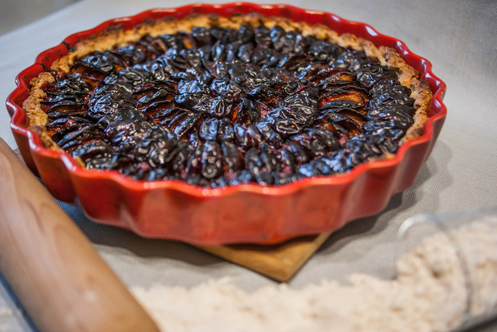

# Tarte aux prunes
(sans glutten, sans lactose et sans oeuf)  

## Ingrédients
Ingrédients pour un moule de 28/30 cm de diamètre
soit 6 à 8 personnes

### Pâte sucrée (fond de tarte)
    200g de farine de riz
    50g de fécule de pomme de terre
    125g de sucre
    125g de beurre végétal tempéré (+ 1 CàS pour le moule)
    2 CàS de graines de chia
    6 CàS d'eau
    1 pincée de sel

### Garniture
    3 à 4 CàS de poudre d'amande
    Prunes (le nombre de prunes dépend de votre gourmandise)
    Sucre en poudre (facultatif)

## Recette
C'est encore la saison des prunes. Outre la confiture de prunes, c'est la tarte aux prunes qui réveille mes papilles et me ramène en enfance. Aussi, je vous propose une recette toute simple, hommage aux desserts de nos grands-mères.

Commencez par faire tremper vos graines de chia dans 6 cuillères à soupe d'eau. Au bout de 15 minutes l'eau va devenir gélatineuse. Ce mélange va servir à remplacer le liant de l'œuf dans la pâte à tarte. Le petit plus, les graines de chia apporteront aussi du croquant.
Préchauffez votre four à 180°
Dans un saladier mélangez l'ensemble des ingrédients secs, farine, fécule, sucre, sel. Ajoutez le beurre tempéré ainsi que le mélange graines de chia et eau. Mélangez le tout avec les doigts et formez une boule. Attention il ne faut pas travailler la pâte trop longtemps.
Beurrez un moule à tarte et étalez-y la pâte à la main.
Répartissez la poudre d'amande sur votre fond de tarte (à la cuisson, elle absorbera le jus des fruits). Déposez ensuite vos prunes lavées, dénoyautées et coupées en deux sur votre fond de tarte. Personnellement j'adore les tartes très riches en fruits. Pour pouvoir en mettre un maximum je pose mes demies prunes à la verticale. Si vos prunes sont un peu acides, n'hésitez pas à les saupoudrez de sucre avant la cuisson.
Enfournez votre tarte pour 45 minutes. Surveillez la cuisson. Votre tarte ne doit pas cuire trop vite pour laisser le temps aux prunes de rendre leur jus et de compoter légèrement.
