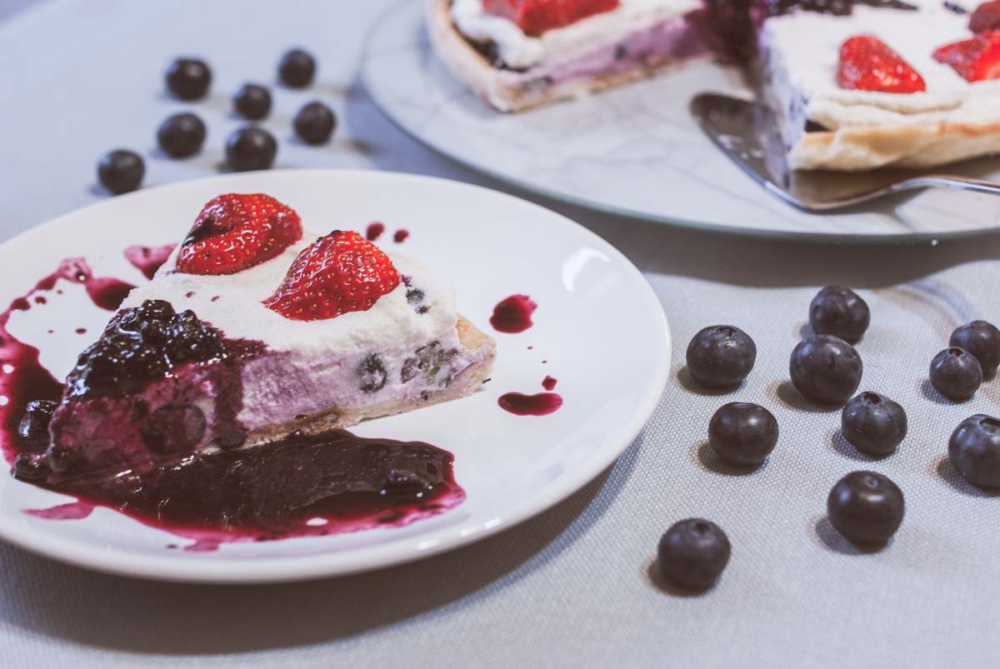

# Tarte cheesecake sans gluten et vegan aux myrtilles
(sans glutten, sans lactose et sans oeuf)  

## Ingrédients
Ingrédients pour 6/8 personnes

    1 pâte feuilletée sans gluten et sans lactose

### Pour la garniture

    100g de noix de cajou trempées dans de l’eau pendant 6 heures
    250g de crème de coco
    100g de miel liquide
    20cl d’huile de coco liquide (légèrement chauffée)
    Le zeste et le jus d’un citron bio
    1 càc de vanille en poudre
    1 pincée de sel
    300g de myrtilles fraîches

### Pour le coulis de myrtilles

    300g de myrtilles fraîches (ou congelées)
    30g de sucre
    le jus d’un demi-citron

### Pour le service (facultatif)

    Des fraises ou des myrtilles fraîches

## Recette
Le cheesecake quand on est intolérant au lactose, c'est carrément impossible. J'ai trouvé ma recette, il y a bien longtemps, dans un rouleau de pâte feuilleté de la marque croustipâte et j'ai enfin décidé de me lancer. Et, je ne suis pas déçue ! Une recette fraîche et crémeuse ! Un vrai régal.

Commencez par préchauffer votre four à 200°.
Déroulez votre pâte dans votre moule à tarte, piquez-la et faites la cuire à blanc 20 à 30 minutes.
Assemblez dans le bol d’un mixeur : les noix de cajou égouttées, la crème de noix de coco, le miel, le zeste de citron et le jus de citron bio, la vanille et le sel. Mixez jusqu’à l’obtention d’un mélange lisse puis ajoutez l’huile de coco liquide petit à petit en continuant de mixer pour obtenir un appareil bien crémeux.
Sur votre pâte cuite et refroidie, étalez les myrtilles fraîches lavées et séchées. Versez ensuite la garniture, étalez-là et mettez au réfrigérateur au moins 8 heures.

Préparez ensuite le coulis de myrtilles.
Si vous avez choisi des myrtilles fraîches, lavez-les et essuyez-les. Versez-les dans une casserole, ajoutez le sucre et le jus de citron. Faites cuire environ 10 à 15 minutes, en remuant régulièrement. Quand le mélange a compoté, retirez-le du feu et laissez refroidir.

Au moment de servir, Déposez votre tarte cheesecake dans votre plat de service. Agrémentez-la de fraises fraîches ou de myrtilles. Servez avec le coulis.
Attention, cette tarte doit être conservée et servie fraîche, l’appareil risque de ramollir à température ambiante.

> Astuce : Vous préférez faire votre pâte vous même, voici d'autre recettes de tarte avec des pâtes différentes :
> - [Tarte aux fraises et crème de pistache](./Tarte-aux-fraises-et-creme-de-pistache.md)
> - [Tarte aux prunes](./Tarte-aux-prunes.md)
> - [Tarte aux pommes bouquet de roses](./Tarte-aux-pommes-bouquet-de-roses.md)
