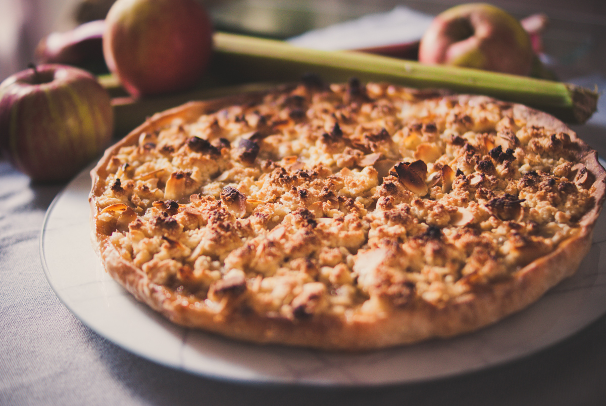

# Tarte crumble à la rhubarbe
(sans glutten, sans lactose et sans oeuf)  

## Ingrédients
Ingrédients pour 6 à 8 personnes

    1 pâte feuilletée sans gluten/lactose et œufs

### Pour la compotée

    400g de rhubarbe
    2 pommes
    1 CàS de beurre végétal
    130g de sucre en poudre

### Pour le crumble

    45g de farine de riz
    45g d'amande en poudre
    50g de beurre
    50g de sucre
    25g d'amandes effilées

## Recette
La semaine passée, j'ai profité d'un petit séjour chez mes parents pour faire de la cueillette dans le jardin et suis revenue avec le coffre plein de rhubarbe. Après avoir réalisé quelques pots de compote j'ai concocté une petite tarte. Encore me direz-vous ? Oui, mais cette fois-ci c'est une tarte crumble.

Commencez par laver, épépiner et couper vos pommes en petits cubes. Faites revenir vos pommes dans le beurre végétal. Pendant ce temps, lavez les tiges de rhubarbe et épluchez-les en enlevant la peau et les filaments. Coupez-les ensuite en petits tronçons. Ajoutez la rhubarbe à vos pommes avec un peu d'eau. Une fois la rhubarbe réduite en compote, ajoutez le sucre et mélangez. Retirez du feu et réservez.
Pendant que votre compotée pomme/rhubarbe cuit, faites chauffer votre four à 180°.
Faites précuire votre pâte feuilletée à blanc pendant 15 minutes environ.
Préparez ensuite le crumble. Dans un saladier, mélangez la farine, la poudre d'amandes, le beurre et le sucre. Mélangez avec les doigts jusqu'à obtention de « miettes » de pâte. Incorporez enfin les amandes effilées.
Passez au montage de votre tarte. Répartissez votre compotée pomme/rhubarbe dans votre fond de tarte et parsemez dessus les miettes de crumble. Enfournez pour une vingtaine de minutes. Servez tiède ou froid.
