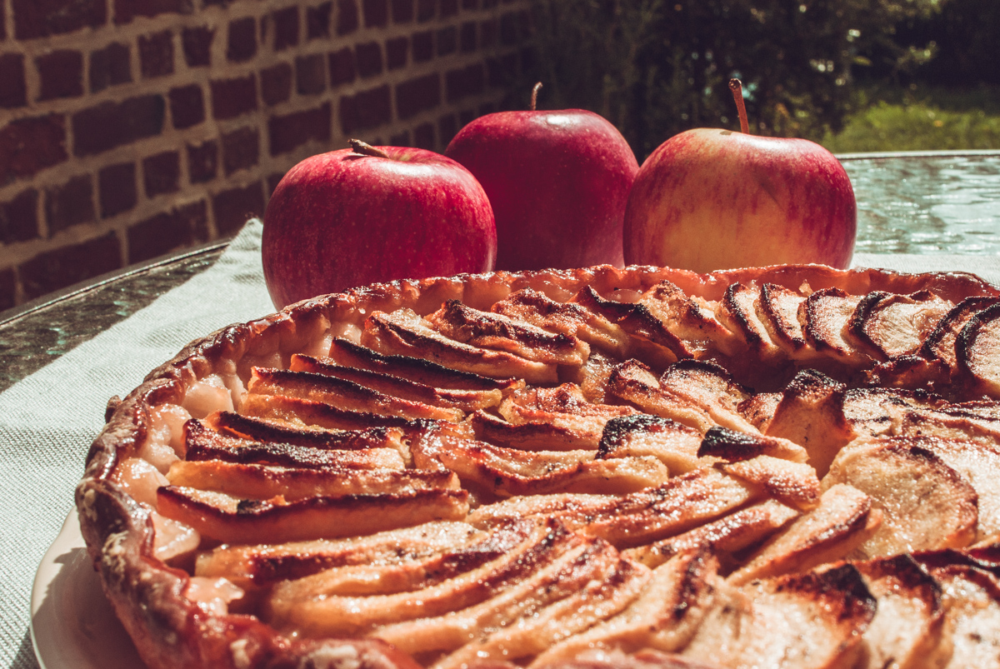

# Tarte pommes et compote de rhubarbe
(sans glutten, sans lactose et sans oeuf)  

## Ingrédients
Ingrédients pour 6 à 8 personnes

    1 pâte feuilletée sans gluten/lactose et œufs
    5 à 6 pommes
    400g de rhubarbe
    Sucre
    Beurre végétal

## Recette
C'est la saison de la rhubarbe ! Cette plante que l'on cuisine comme un fruit est un délice une fois son acidité réduite. En confitures, en compotes en gâteaux ou en tartes, laissez-vous séduire.

Commencez par préparer la compote de rhubarbe. Lavez les tiges et épluchez-les en enlevant la peau et les filaments. Coupez-les ensuite en petits tronçons. Lavez, épluchez et coupez une pomme en petits morceaux. Mettez la pomme et la rhubarbe dans une casserole avec un fond d'eau et laissez compoter une vingtaine de minutes. Sucrez à votre convenance. (Pour une compote très sucrée il vous faudra 100 g de sucre et pour une compote encore un peu acidulée, environ 70g). Laissez refroidir.
Préchauffez votre four à 180°.
Foncez un moule à tarte avec une pâte feuilletée sans gluten et piquez-la. Tapissez le fond de tarte avec la compote de rhubarbe. Lavez, épluchez et découpez en quartiers puis en fines lamelles le reste des pommes et répartissez-les en cercle sur la compote de rhubarbe. Saupoudrez d'un peu de sucre si vous aimez les tartes bien sucrées et répartissez quelques morceaux de beurre sur les pommes. Enfournez pour une trentaine de minutes. Servez tiède ou froid.

> Astuce : Les pâtes sans gluten, sans lactose et sans œufs se trouvent très facilement. Vous pouvez en trouver dans votre supermarché ou dans tous les magasins bio qu'elles soient fraîches et prêtes à dérouler ou congelées à étaler. Si toutefois vous préférez faire votre fond de tarte maison, voici quelques idées de pâtes sucrées :
> - [Tarte aux fraises](./Tarte-aux-fraises-et-creme-de-pistache.md)
> - [Tarte aux prunes](./Tarte-aux-prunes.md)
