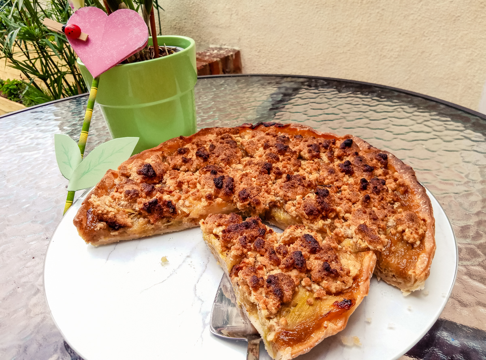

# Tarte rhubarbe amandine en crumble
(sans glutten, sans lactose et sans oeuf)  

## Ingrédients
Ingrédients pour une tarte 6 à 8 personnes

    Pâte feuilletée sans gluten (ou une pâte sucrée maison)
    600g de rhubarbe
    1 grosse pomme (ou 2 petites)
    175g de sucre cassonade
    150g de poudre d’amande
    75g de farine de riz
    75g de beurre végétal

## Recette
C’est la saison de la rhubarbe. A la maison on adore ça et le choix est toujours compliqué entre confiture, compote ou dessert. Cette fois-ci j’ai opté pour une recette que j’ai vu passer sur les réseaux et qui m’a immédiatement fait de l’œil… Comme d’habitude un ou deux petits arrangements personnels, et hop ;) on s’est régalé :p

Préchauffez votre four à 200°.
Épluchez la rhubarbe puis coupez la en tronçons. Faites de même avec la pomme. Versez dessus 100g de sucre cassonade et faites compoter à feux doux pendant une quinzaine de minutes. La rhubarbe doit rester moelleuse sans complètement se défaire.
Pendant ce temps, préparez le crumble en mélangeant les 75g de sucre cassonade restant, la farine, 75g de poudre d'amandes et le beurre du bout des doigts sans chercher à faire une boule. La pâte doit rester sableuse. Réservez au frais.
Lorsque vos fruits sont prêts, assemblez votre tarte crumble. Étalez la pâte dans un moule, parsemez la poudre d'amandes restante, la compotée de rhubarbe et le crumble. Enfournez 25 minutes.
A déguster tiède ou froid ;)
