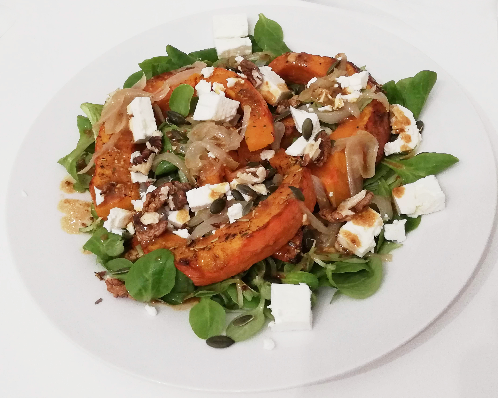

# Salade d’automne au potimarron rôti et à la feta
(sans glutten, sans lactose et sans oeuf)  

## Ingrédients
Ingrédients pour 2 personnes :

    ½ potimarron
    2 poignées de salade, de préférence de la mâche
    1 gros oignon
    100g de feta en dés
    des herbes de Provence
    1 CàS de graines de courge
    1 CàS de cerneaux de noix de Grenoble
    Huile d’olive
    Sel et poivre à votre convenance
    
    1 càc de moutarde à l’ancienne
    2 CàS d’huile d’olive
    2 CàS de vinaigre balsamique
    Sel et poivre à votre convenance

## Recette
Ce n’est pas parce qu’on est en automne ou en hiver qu’on ne peut pas manger une bonne salade composée. Potimarron et feta se marient à merveille dans cette salade chaud/froid pour réchauffer les cœurs et faire saliver les papilles.

Faites préchauffer votre four à 200°C.
Lavez le potimarron. Coupez-le en deux et enlevez les pépins. Coupez une moitié du potimarron en lanières et disposez-les sur une plaque allant au four. Pas besoin de l’éplucher, une fois cuite la peau sera parfaitement tendre. Arrosez-les d’un filet d’huile d’olive. Frottez-les avec vos mains ou un pinceau pour que l’huile soit répartie de manière uniforme. Répartissez les herbes de Provence et salez et poivrez à votre convenance. Enfournez pour 20 à 30 minutes. Surveillez la cuisson, tout dépend de l’épaisseur de vos lanières.
Réservez l’autre moitié pour une autre recette.
Pendant que votre potimarron se dore la pilule au four, émincez votre oignon en lanières et faites-le cuire dans un peu d’huile d’olive puis réservez au chaud.
Dans un bol préparez votre vinaigrette en mélangeant la moutarde à l’ancienne, l’huile d’olive et le vinaigre balsamique. Salez et poivrez à votre convenance.
Une fois le potimarron cuit, (la lame du couteau doit s’enfoncer facilement dans la chair), vous pouvez passer à l’assemblage des différents éléments. Dans chaque assiette répartissez une belle poignée de mâche. Déposez ensuite vos lanières de potimarron encore chaud. Parsemez avec de l’oignon cuit et les dés de feta. Assaisonnez avec la vinaigrette au balsamique. Pour ajouter du croquant parsemez des cerneaux de noix de Grenoble et des graines de courge.
Une assiette pleine de vitamines et de couleurs.

> Astuce : Vous ne tolérez pas le lactose? Vous êtes vegan? Cette salade est aussi très bonne sans la feta.
