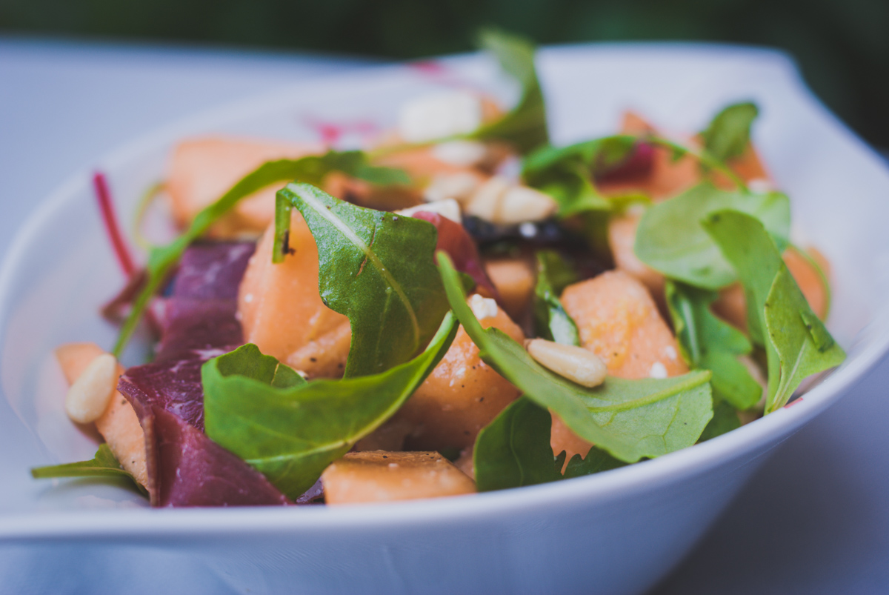

# Salade de melon à la feta, roquette, viande des grisons et pignons de pin
(sans glutten, sans lactose et sans oeuf)  

## Ingrédients
Ingrédients pour 2 personnes

    1 petit melon
    8 tranches de viande des grisons
    2 poignées de roquette
    60g de feta (facultatif. Seulement si vous la tolérez)
    2 CàS de pignons de pin
    Quelques feuilles de basilic (ma préférence va ici pour le basilique rouge)
    Le zeste d’un citron
    Le jus d’un demi citron
    1 CàS d’huile d’olive
    Sel
    Poivre noir

## Recette
La salade de melon est vraiment mon best de l’été. J’aime la réinventer encore et encore. Je vous propose aujourd’hui, celle qui m’a accompagnée tout l’été.

Coupez le melon en deux, épépinez-le, videz la chair et coupez-la en petits morceaux. Conservez au frais.
Lavez le citron et prélevez les zestes. Pressez le jus de la moitié de ce citron. Dans un petit bol mélangez les zestes de citron, le jus de citron et l’huile d’olive. Ajoutez une pincée de sel et du poivre à votre convenance.
Dans un saladier, mélangez le melon, la roquette, la feta coupée en petits cubes et la viande des grisons coupée en lanières. Ajoutez vos feuilles de basilic lavées et émincées ainsi que les pignons de pin. Assaisonnez avec votre vinaigrette au citron et mélangez de nouveau.
Répartissez votre salade dans votre (ou vos) plats de service. Servez bien frais et régalez-vous.

> Astuce : Cette salade est également très bonne si vous remplacez la feta par des copeaux de parmesan et la viande des grisons par un jambon de pays ;)
