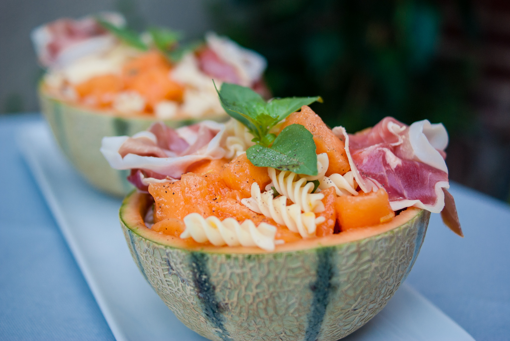

# Salade de melon au basilic et jambon de pays
(sans glutten, sans lactose et sans oeuf)  

## Ingrédients
Ingrédients pour 2 personnes

    1 petit melon
    4 tranches de jambon de pays (votre préféré)
    100g de pâtes cuites sans gluten
    Quelques feuilles de basilic
    Le zeste d’un citron
    Le jus d’un demi citron
    1 CàS d’huile d’olive
    Sel
    Poivre noir
    Copeaux de parmesan (facultatif – seulement si vous le tolérez)

## Recette
Une salade estivale où le citron, le basilic, le sel et le poivre viennent sublimer la saveur du melon :)
Accompagnée de quelques pâtes et d’un jambon de pays, pour un repas léger et savoureux.Faites cuire vos pâtes comme indiqué sur le paquet et conservez au frais.
Couper ensuite le melon en deux, épépinez-le, videz la chair et coupez-la en petits morceaux. Conservez au frais.
Lavez le citron et prélevez les zestes. Pressez le jus de la moitié de ce citron. Dans un petit bol mélangez les zestes, le jus et l’huile d’olive. Ajoutez une pincée de sel et le poivre.
Dans un saladier, mélangez le melon, les pâtes et votre sauce à base de citron. Ajoutez vos feuilles de basilic lavées et émincées. Gardez en quelques-unes pour décorer.
Répartissez votre salade dans votre (ou vos) plats de service. Décorez à l’aide de votre jambon de pays. Si vous le tolérez parsemez de parmesan.
Servez bien frais et régalez-vous.

> Astuce : Gardez les peaux de votre melon, elles pourront vous servir de petits saladiers de présentation (comme sur la photo de l’article). Privilégiez la fleur de sel et le poivre du moulin pour de meilleures saveurs.
