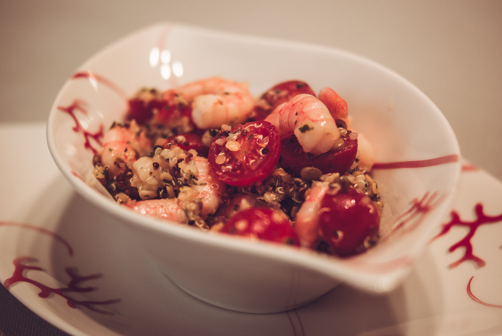

# Taboulé au quinoa, lentilles, crevettes roses, citron vert et orange
(sans glutten, sans lactose et sans oeuf)  

## Ingrédients
Ingrédients pour 8 personnes

    300g de mélange 3 quinoas (rouge, blanc noir) cuit. A défaut du quinoa blanc
    150g de lentilles blondes cuites
    150g de lentilles corail cuites
    400g de grosses crevettes roses crues et décortiquées
    400g de tomates cerise
    3 grosses échalotes
    Le jus de 2 citrons verts
    Le jus d'une orange
    5 CàS d'huile d'olive
    1 petit bouquet de persil
    1 petit bouquet de menthe
    1 petit bouquet de coriandre
    sel et poivre

## Recette
Simple à préparer, frais et léger, le taboulé est un plat emblématique du bassin méditerranéen. Généralement préparé à base de boulgour ou de semoule, ce plat est parfumé d'herbes fraîches comme du persil plat et/ou de la menthe. Aujourd'hui c'est une version à base de quinoa et de lentilles parfumée au persil, à la menthe et à la coriandre que je vous propose et agrémentée de crevettes roses pour en faire un plat complet.

Commencez par cuire le quinoa, et les lentilles selon les instructions écrites sur les paquets. Réservez au frais.
Dans un wok faites cuire les crevettes dans 1 CàS d'huile d'olive.  Ajoutez le jus d'orange et le bouquet de coriandre ciselée. Salez et poivrez à votre convenance. Réservez au frais.
Dans un saladier mélangez le quinoa, les lentilles ainsi que les crevettes et leur jus à l'orange et à la coriandre. Ajoutez 4 CàS d'huile d'olive, le jus des deux citrons verts, les échalotes finement émincées, la menthe et le persil ciselé ainsi que les tomates cerise coupées en deux. Mélangez bien et rectifiez l'assaisonnement. Servir bien frais.

> Astuce : Dans l'idéal, préparez cette salade la veille pour le lendemain afin que les herbes puissent déployer toutes leurs saveurs. Pour plus de fraîcheur vous pouvez également ajoutez des dés de concombre à cette salade.
