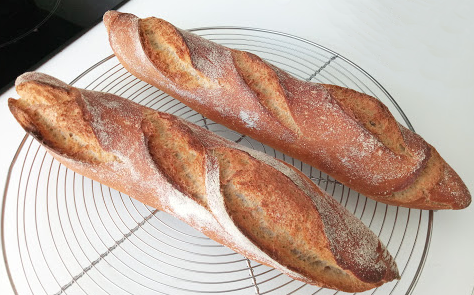

# Baguettes 

## Ingrédients
pour 3 baguettes

    560g de farine (510g de T65 et 50g de T110)
    39cl d'eau tiède 
    13g de sel 
    5g de levure sèche (ou 20g de levure fraiche)

## Recette
Mélanger d'un côté eau et levure, et de l'autre farines et sel. Laisser la levure agir pendant un quart d'heure. Ajouter le solide au liquide et mélanger au robot vitesse 1 pendant 5 minutes ou pétrir pendant 10 à 15 minutes. Bouler et réserver le paton dans un saladier, couvert d'un linge. Au bout de 20 minutes, verser délicatement le paton sur le plan de travail sans ajouter de farine (le paton est collant mais le sera de moins en moins). Appliquer 4 rabats en emprisonnant un maximum d'air. Retourner le paton, bouler légèrement et réserver le paton dans le saladier. Répéter cette opération 3 fois (pour une levée d'une heure). Laisser reposer la pâte pendant 2h (ou une nuit au frigo). Si la pâte était au frigo, laisser reposer à température ambiante une quarantaine de minutes. Séparer la pâte en 3 (environ 280g) et bouler chaque paton sans trop dégazer.

Pincer deux bords opposés, étirer le paton en le tapotant sur le plan de travail, rabattre les deux coins au centre. Prendre un côté et le rabattre sur les deux tiers de la pate, emprisonner l'air en soudant le bord. Repartir du même bord et rabattre le boudin, souder à nouveau la pate. Rouler le boudin légèrement. Laisser poser 10 minutes.

Recommencer l'étape de façonnage (pincer, rabattre, rouler, ...). Faconner la forme des baguettes en partant du centre et en appuyant tout en écartant les mains. Réserver la baguette sur un linge plié et fariné et laisser lever 30 minutes.

Grigner le pain sur 3 entailles et enfourner à 220°C en faisant une buée en début de cuisson.

Sortir les baguettes du four au bout de 30 minutes et les poser sur une grille.
