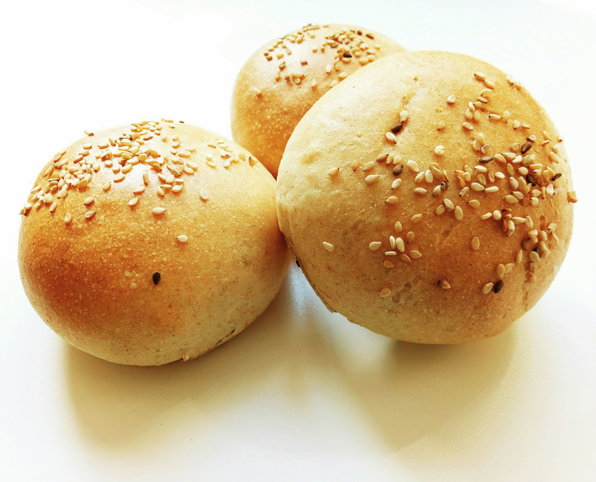

# Pains à buns pour Hamburger

## Ingrédients
Pour 6 ~ 7 pains

    15cl d'eau
    15cl de lait
    15g de sucre
    8g de sel
    60g de beurre en dés
    500g de farine
    5g de levure sèche (ou 20g de levure fraiche)

## Recette
Mélanger les liquides tièdes (30 secondes au micro onde), la levure et le sucre. La chaleur et le sucre vont activer la levure. Laisser la levure agir pendant un quart d'heure. Ajouter le beurre, la farine et le sel. Pétrir à la machine (vitesse lente) pendant 7 minutes ou à la main pendant 10 à 15 minutes. Il est important de terminer le pétrissage à la main pour sentir la pâte changer de consistence. Une fois le glutten cassé, elle devient plus tendre et élastique. Bouler, poser la pâte dans un saladier, couvrir et faire une levée de deux heures à température ambiante ou une heure au four (en étuve ou à 30~40°C).  

Retirer délicatement la pâte du saladier (elle doit avoir doublé de volume). Séparer les pâtons (110~120g donnent un pain très correct pour un hamburger). Bouler chaque pâton et les applatir légèrement. Couvrir et faire une seconde poussée d'une heure.

Pendant le préchauffage du four à 180°C, placer les pâtons sur un papier cuisson, les badigeonner d'un peu de lait, les pains seront plus dorés et la pincée de sésame qu'on met ensuite tiendra mieux.

Au bout de 15 minutes de cuisson, sortir les pains du four et les poser sur une grille.
